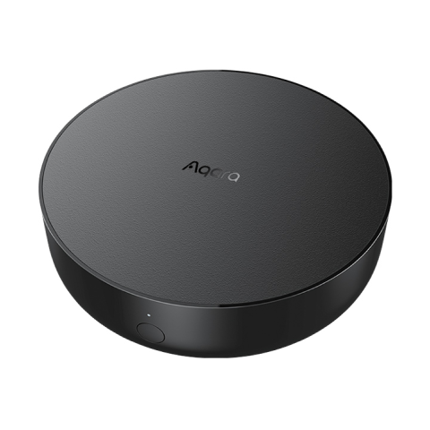

---
layout:
  title:
    visible: true
  description:
    visible: false
  tableOfContents:
    visible: true
  outline:
    visible: true
  pagination:
    visible: false
---

# 스마트 허브 M2

<figure><figcaption></figcaption></figure>

### 제품소개

> 스마트 허브 M2는 스마트홈 컨트롤 센터로 WiFi(무선) 또는 Ethernet(유선)으로 연결되어 다양한 Zigbee장치들과 상호작용 합니다. 또한 스마트 리모컨 기능까지 탑재하여 플러그, 조명, 커튼 뿐만 아니라 에어컨, 선풍기 등 가전까지 더욱 편리하게 컨트롤하게 해 줍니다.\
> \* 본 제품은 실내에서만 사용 가능합니다.



<figure><figcaption></figcaption></figure>

### 제품 사양

| 제품명            | 스마트 허브 M2                                                         |
| -------------- | ----------------------------------------------------------------- |
| 모델명            | HM2-G01                                                           |
| 제품 크기          | Φ100.5 x 30.75mm                                                  |
| 입력 전압          | 5V/1A 또는 5V/2A                                                    |
| 무선 연결          | Wi-Fi IEEE 802.11 b/g/n 2.4GHz, Zigbee 3.0 IEEE 802.15.4, BLE 5.0 |
| 작동 온도          | -5°C \~ 50°C                                                      |
| 작동 습도          | 0\~95% RH /비결로 조건                                                 |
| 시스템 지원         | 안드로이드 6.0 또는 iOS 12.0 및 그 이상 버전                                   |
| 와이파이 동작 주파수 대역 | 2412-2472 MHz                                                     |
| 와이파이 최대 출력     | < 20 dBm                                                          |
| 블루투스 동작 주파수 대역 | 2402-2480 MHz                                                     |
| 블루투스 최대 출력     | < 13dBm                                                           |
| 지그비 동작 주파수 대역  | 2405-2480 MHz                                                     |
| 지그비 최대 출력      | < 13dBm                                                           |

### 기본 기능

* 안내 음성 언어 변경: 장치 탭에서 스마트 허브 M2를 선택한 뒤 우측 상단의 …을 눌러 추가 설정에서 안내 음성 언어를 변경하세요.
* 하위 기기 추가: 허브가 성공적으로 추가되었다면 연결할 하위 기기의 퀵 가이드를 참조하여 하위 기기를 추가하세요.
* IR 가전 컨트롤(스마트 리모컨): app 안내에 따라 컨트롤해야 할 IR 가전의 브랜드와 모델을 app에서 선택합니다. 설정이 완료되면 app에서 선택합니다. 설정이 완료되면 app에서 가전을 제어하거나 자동실행을 설정해 보세요.
* 스마트 허브 M2 공장 초기화: 허브 전면의 버튼을 10번 빠르게 누릅니다.



### 주의 사항

* 본 제품은 어린이가 사용할 경우 위험할 수 있으므로. 어린이의 손이 닿지 않는 곳에 두십시오.
* 본 제품은 실내 사용 용도로 설계되었습니다. 습한 환경이나 실외에서 사용하지 마십시오.
* 비바람에 노출된 장소, 물이 튀는 곳에 설치하지 마세요. 물 또는 액체류를 제품에 엎지를 경우 고장, 감전 및 화재의 위험이 있습니다.
* 본 제품을 열원 부근에 놓지 마십시오. 환기가 잘 되지 않는 밀폐된 공간에서 사용하지 마십시오.
* 본 제품을 임의로 분해, 수리, 개조하지 마십시오. 수리가 필요한 경우 support@aqara.kr로 연락 주십시오.
* 본 제품은 생활의 편리 및 편의성을 개선하기 위한 용도로 적합합니다. 가정. 건물, 창고 또는 다른 장소의 방범 용도로 사용하는 것을 권장하지 않습니다. 사용자가 상기 사용 지침을 따르지 않고 해당 제품을 사용할 경우 발생하는 어떠한 위험 및 재산 손실에도 제조사는 귀책이 없음을 알려 드립니다.
* 일반적인 사용 상황에서 본 제품과 사용자의 신체 사이에 최소 20cm 이상의 거리를 유지해야 합니다.





### 설치 전 확인 사항

* Wi-Fi 또는 데이터 통신 방식을 지원하는 스마트폰이나 태블릿이 필요합니다. (iOS, Android 모두 가능)
* Wi-Fi에 연결이 되어 있고 네트워크 연결이 안정적인지 확인해 주세요.

### 제품 설치

허브 설치 위치 선택: 허브는 집의 공유기로부터 2-6m 정도 떨어져 있어야 하며, 허브와 공유기 사이 그리고 허브 주변에 금속 차폐물이 없도록 하는 것이 좋습니다.

<figure><figcaption></figcaption></figure>

허브에 전원 연결: 5V-1A 또는 5V-2A 어댑터(별매)와 USB전원선을 사용하여 허브에 전원을 연결하세요.

* 허브와 공유기 간에 유선 네트워크 통신을 사용해야 하는 경우, RJ45랜케이블을 사용하여 허브 LAN포트와 공유기 LAN포트를 연결하고 허브측 포트에 램프가 깜빡이는 것을 확인하세요.

<figure><figcaption></figcaption></figure>

허브 지시등이 노란색(또는 빨간색)이 켜져 있는 상태에서 깜빡임 표시로 바뀔 때까지 기다리세요, (초기 안내 음성은 영어로 진행됩니다.)

스마트폰의 Wi-Fi를 켜고 허브를 연결하려는 Wi-Fi와 동일한 2.4GHz Wi-Fi에 연결해 주세요.

* 듀얼밴드 공유기를 사용하는 경우 스마트폰이 5GHz Wi-Fi와 연결되지 않도록 주의 하세요.
* 연결하는 동안 스마트폰은 가능한 허브와 가까운 위치를 유지해 주세요.

### Aqara Home 앱 연동

앱 스토어에서 “Aqara Home”을 검색해 다운로드해주세요.

#### 허브 등록 하기

아카라홈 앱을 열고, 메인화면에서 우측 상단 ’+’를 클릭하고 ’스마트 허브 M2’를 선택한 뒤 앱의 지시에 따라 허브를 등록하세요.

* IOS 사용자인 경우 애플 홈킷에서 제어를 원하신다면 아카라홈 앱을 열기 전 허브 밑 부분 또는 설명서에 있는 홈킷 설정 코드(보관필요)를 아카라홈 앱에서 스캔하거나 수동으로 입력해 허브를 애플 홈킷에 바인딩합니다. 바인딩이 완료되면 애플 홈앱에 허브가 추가된 것을 확인할 수 있습니다.

만약 추가에 실패했다면 허브의 리셋 버튼을 10초 이상 누르세요. 잠시 후 노란색(또는 빨간색) 표시등이 깜빡이면 위의 연결 절차를 다시 진행해 주세요.

허브 추가에 실패하면 다음 사항을 확인하세요.

* <mark style="background-color:yellow;">디바이스가 2.4 GHz 와이파이에 연결되어 있는지 확인하세요.</mark>
* <mark style="background-color:yellow;">와이파이 이름 또는 비밀번호에 지원되지 않는 특수문자가 포함되어 있어 라우터에 연결할 수 없는 경우, 일반 문자로 비밀번호를 변경 후 다시 시도하세요.</mark>
* <mark style="background-color:yellow;">WAP/WAP2 와이파이 네트워크는 지원하지 않습니다.</mark>
* <mark style="background-color:yellow;">라우터에 와이파이 무단 사용 방지 기능이 켜져 있다면 끄고 시도하세요.</mark>
* <mark style="background-color:yellow;">라우터의 AP 분리 기능으로 인해 휴대폰이 LAN내부에서 디바이스를 찾을 수 없는지를 확인하세요.</mark>
* <mark style="background-color:yellow;">휴대폰 어플 중에 “adguard”라고 하는 광고 스팸 차단하는 어플이 있는지 확인하시고, 만약 있다면, “adguard”앱 설정에서 “Aqara Home”앱을 필터링 해제 해 주세요.</mark>

HomeKit 연동에 실패하면 다음 사항을 확인하세요.

* 액세서리 추가 실패시 반복적인 실패로 인한 정보 찌거기가 오류를 유발합니다. iOS 장비를 재부팅하고 초기화한 다음, 다시 시도하세요. 계속 실패할 경우, 라우터 호환성을 점검하고 다른 기기로 교체하여 시도하세요.
* 액세서리가 이미 추가되었다는 메시지가 나온다면, iOS장비를 재부팅하고 초기화한 다음, HomeKit 설치 코드를 수동으로 입력하고 다시 추가하세요.



### 지시등 상태 설명

| **지시등 상태**                     | **장치 상태**                                                                           |
| ------------------------------ | ----------------------------------------------------------------------------------- |
| 
노란색 또는 빨간색

지시등 점등
 | 전원 인가 후 시스템 작동 준비 중                                                                 |
| 
노란색 또는 빨간색

지시등 점멸
 | 
허브가 초기화되었으며 연결 대기중.

처음 사용하거나 리셋 후 15분 이내동안 점멸
                          |
| 파란색 점멸                         | Wi-Fi 연결 중, 앱이 허브와 연결중 또는 연결될 네트워크 찾는 중                                             |
| 파란색 점등                         | 정상 작동 중                                                                             |
| 흰색 점멸                          | Wi-Fi 연결 중                                                                          |
| 흰색 점등                          | 
허브가 네트워크에 접속 불가

(정상 작동을 위해서는 전원을 차단한 후

다시 전원을 입력하거나 허브의 리셋이 필요함)
 |
| 보라색 점멸                         | 하위 기기 추가 허용                                                                         |

* 장치 펌웨어 업그레이드 및 업데이트로 인해 실제 동작은 위의 설명과 약간 다를 수 있으므로 현재 앱의 지침 또는 실제 장치 상태 프롬프트를 따르십시오.
* 본 제품은 HomeKit을 지원하는 기기로서 최신 버전의 iOS 또는 iPadOS를 사용하는 것을 권장합니다. HomeKit을 지원하는 기기를 원격으로 제어하거나 자동화 설정하려면 HomePod 또는 Apple TV 또는 이미 홈 허브로 설치된 iPad 한 대를 설치해야 하며 소프트웨어와 운영 체제를 최신 버전으로 업데이트할 것을 권장합니다.
* 허브와 iPhone, iPad, Apple Watch, HomePod 또는 Mac 사이의 통신은 Homekit 기술보호를 받게 됩니다.
* Works with Apple 로고를 사용하는 것을 이 제품이 로고에 표시된 기술과 연동하여 사용할 수 있도록 디자인 되었다는 것을 의미하며, 개발자에 의해 인증되었고, Apple의 성능 기준에 부합합니다. Apple은 해당 제품의 조작 또는 그에 적합한 안저 기준에 책임을 지지 않습니다.



