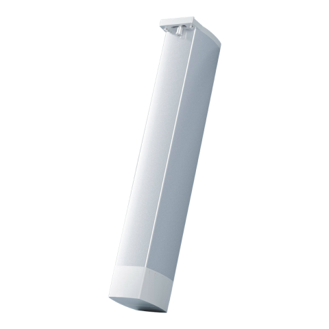

---
layout:
  title:
    visible: true
  description:
    visible: false
  tableOfContents:
    visible: true
  outline:
    visible: true
  pagination:
    visible: false
---

# 스마트 커튼 컨트롤러

<figure><figcaption></figcaption></figure>

### 제품 소개

> 아카라 스마트 커튼 컨트롤러는 Zigbee 통신 모듈을 탑재한 저소음 커튼 모터입니다. 센서를 사용하여 자동으로 커튼을 닫거나, 미리 설정한 스케줄에 따라 커튼을 제어 할 수 있으며, 장애물이 있는 경우 자동으로 커튼을 멈추는 등 다양하고 멋진 시나리오를 구성할 수 있습니다.


* 스마트 커튼 컨트롤러를 사용하기 위해서는 호환 가능한 Zigbee 허브가 필요합니다.
* 애플 HomeKit, 구글홈에서 사용하기 위해서는 아카라 허브가 반드시 필요합니다.




<figure><figcaption></figcaption></figure>

### 제품 사양

| 제품명        | 스마트 커튼 컨트롤러                          |
| ---------- | ------------------------------------ |
| 모델명        | ZNCLDJ11LM                           |
| 제품 크기      | 70 x 50 x 346 mm                     |
| 무선 프로토콜    | Zigbee                               |
| 정격 전압/전류   | 100-240V \~50/60Hz / 0.14A           |
| 정격 토크/이동시간 | 1.2 Nm / 14cm/s                      |
| IP 등급      | IP40                                 |
| 최대 하중      | 50kg (단, 레일에 따라 다를 수 있으므로 30kg이하 추천) |
| 작동 온도      | -20°C \~ 55°C                        |
| 작동 습도      | 10% \~ 90% RH / 비결로 조건               |
| 작동 방식      | S2 12min                             |
| 전선 길이      | 4m                                   |



### 주의 사항

* 본 제품을 설치하는 과정에서 강한 전류가 필요하기 때문에 전문 커튼업체를 통해 설치하셔야 합니다. 제품 설치 시에는 반드시 주 전원 스위치를 끈 상태로 설치하시기 바랍니다.
* 본 제품은 실내 전용 제품으로 설계되었으므로 실외나 습한 환경에서 사용하지 마시기 바랍니다.
* 본 제품에 물 또는 액체를 엎지르는 경우 고장, 감전 및 화재의 위험이 있습니다.
* 본 제품을 열원 부근에 설치하지 마십시오.
* 본 제품을 임의로 분해, 수리, 개조하지 마십시오. 수리가 필요한 경우 support@aqara.kr로 연락하십시오.


### 경고

* 안전한 설치를 위해 다음의 안전 지침을 꼭 확인하고 메뉴얼을 보관해 주세요.
* 안전 지침을 꼭 지켜주세요. 부주의한 설치는 큰 사고로 이어질 수 있습니다.
* 모터의 청소, 수리, 교체 등을 진행할 때 꼭 전원을 차단하고 진행하세요.
* 이 기기의 8살 미만의 어린아이가 사용해서는 안 됩니다. 장난감이 아니므로 주의해 주세요. 본 제품을 다룰 능력이 부족한 어린이나 노인 등이 사용하기 위해서는 본 제품을 안전하게 사용하는 방법과 위험성에 대한 부분이 충분히 숙지 되어야 합니다.
* 컨트롤러를 어린아이 손이 닿지 않는 곳에 두어 가지고 놀지 못하게 하세요.
* 케이블이 손상을 입은 경우, 큰 사고를 예방하기 위해 제조사 또는 이와 관련된 승인 받은 사람에 의해 교체를 진행해야 합니다.
* 본 제품에 있는 전원 공급 케이블은 제품 제조사에서 공급한 완전히 동일한 제품으로 교체되어야 합니다.
* 주기적으로 제품의 불균형, 케이블의 손상 정도등을 체크해 주세요. 1년에 한번은 체크하는 것을 권장드립니다.
* 주변에서 창문 청소 등을 진행할 때는 제품을 동작 시키지 마세요.
* 주변에서 창문 청소 등을 진행할 때는 전원 공급을 차단하세요.
* 제품 설치 전 불필요한 장치나 선들을 정리 및 제거해 주세요.
* 해당 장치의 구동부는 전동식으로 설계되었으며 전자식 커튼, 블라인드에서 사용하도록 설계되었습니다.




### 제품 설치

* <mark style="color:red;">해당 장치의 설치는 커튼 전문 설치업자가 진행해야 합니다.</mark>
* <mark style="color:red;">실내 전용 제품으로 실외에서 사용하지 않도록 주의해 주시기 바라며, 설치 시에는 창문을 닫고 진행하셔야 합니다.</mark>

**배선 안내**

* 파란색: 중성선 , 갈색: 전원선 , 노란색-연두색: 접지선

<figure><figcaption></figcaption></figure>

### Aqara Home 앱 연동

앱 스토어에서 “Aqara Home”을 검색해 다운로드해주세요.

#### 장치 추가

* 사용 설명서에 따라 아카라 앱에 허브를 추가하세요.
* 아카라홈앱을 열고 메인 화면에서 오른쪽 상단 구석의 “+”를 누르고, “장치 추가”를 누릅니다. “커튼 & 블라인드” 탭을 누르시고 “스마트 커튼 컨트롤러” 선택하신 후, 지시에 따라 장치를 추가 합니다. - 만일 연결에 실패하였다면, 허브를 스윛에 가깝게 옮긴 후 전원을 투입하고 다시 시도해 보세요.
* 연결이 되지 않는 경우, 액세서리를 허브에 더 가까이 이동시켜서 다시 시도해 주십시오.

**연결 유효 범위 테스트**

제품을 설치하시고자 하는 위치에 위치시킨 후 커튼 하단의 초기화 버튼을 살짝 누릅니다. 제품이 연결 가능한 범위에 있는 경우 허브가 정상 연결되었음을 음성으로 안내합니다.


