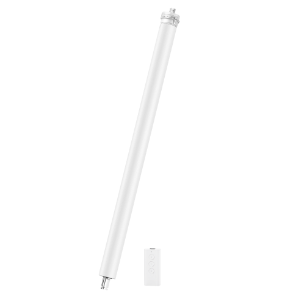

---
layout:
  title:
    visible: true
  description:
    visible: false
  tableOfContents:
    visible: true
  outline:
    visible: true
  pagination:
    visible: false
---

# 스마트 블라인드 컨트롤러

<figure><figcaption></figcaption></figure>

### 제품 소개

> 아카라 스마트 블라인드 컨트롤러는 전기 스마트 커튼 모터로, 일반 롤러 블라인드, 샹그릴라 블라인드 및 기타 커튼을 자동화 할 수 있습니다. 이 제품은 내장된 Zigbee 무선 통신 모듈을 갖추고 있습니다. 허브 기능을 갖춘 Aqara 기기와 페어링하면 커튼의 원격 제어, 특정 시간에 열고 닫기, 여러 기기 간의 스마트 연결과 같은 기능을 구현할 수 있습니다.


본 제품은 허브 기능을 가지고 있는 아카라 허브(M2, E1, G2HPro, G3)와 연결해야 합니다.




### 제품 사양

| 제품명                           | 스마트 블라인드 컨트롤러              |
| ----------------------------- | -------------------------- |
| 모델명                           | ZNGZDJ11LM                 |
| 제품 크기                         | 59.4 x 4.1 x 3.9cm         |
| 제품 무게/직경                      | 1.44kg / 35mm              |
| 정격 전압/전류                      | 220-230V\~ 50/60Hz / 0.43A |
| 소비 전력                         | 98W                        |
| 전원 방식                         | AC 전원                      |
| 최대 하중                         | 30kg                       |
| 작동 온도                         | 0°C\~40°C                  |
| 작동 습도                         | 0\~95% RH / 비결로 조건         |
| 정격 토크/이동속도                    | 8N·m / 17 r/min            |
| 무선 프로토콜                       | Zigbee                     |
| 전선 길이                         | 4m                         |
| 평가 작동 시간                      |  4분                        |
| 투블러 드라이브를 삽입하는 데 필요한 최소 튜브 지름 | 35mm                       |



### 주의 사항

* 전기 작업을 포함하는 본 제품의 설치 프로세스는 강한 전류를 사용하므로 전문 커튼 설치업체에게 명세에 따라 설치를 맡기십시오.
* 본 제품은 실내에서만 사용하도록 되어 있습니다. 습기가 많거나 외부에서 사용하지 마십시오.
* 제품에 수분이 닿지 않도록 유지하고, 물이나 다른 액체를 제품에 쏟지 마십시오.
* 제품을 열원에서 멀리 두십시오.
* 제품의 유지보수를 스스로 시도하지 마십시오. 유지보수는 권한을 가진 전문가에 의해 수행되어야 합니다.
* 정상 사용 시에는 이 장비와 사용자 간의 안테나와 최소 20cm의 거리를 유지하십시오


### 경고

* 경고: 중요한 안전 지침. 이 지침을 따르지 않으면 사람들의 안전에 위험할 수 있습니다. 이 지침을 저장하세요.
* 경고: 중요한 안전 지침. 부정확한 설치는 심각한 부상을 초래할 수 있으므로 모든 지침을 따르세요.
* 경고: 청소, 유지보수 및 부품 교체 중에는 전원을 차단해야 합니다.
* 이 기기는 8세 미만의 어린이가 사용해서는 안 됩니다. 이 기기는 장난감이 아니며 어린이가 노는 데 사용해서는 안 됩니다. 어린이는 청소 및 사용자 유지보수를 해서는 안 됩니다. 이 기기는 8세 이상 또는 감독이 있는 경우 감독을 받은 지침에 따라 안전하게 사용할 수 있는 경우 사용할 수 있습니다.
* 고정 제어 장치로 어린이가 노는 것을 허용하지 마세요. 원격 제어는 어린이의 손에 닿지 않게 하세요.
* 전원 공급 케이블이 손상된 경우 제조업체, 서비스 대행업체 또는 유사한 자격을 갖춘 사람에 의해 교체되어야 합니다. 위험을 피하기 위해 손상된 케이블을 교체해야 합니다.
* 이 드라이브의 전원 공급 케이블은 드라이브 제조업체에서 공급한 동일한 유형의 케이블로만 교체될 수 있습니다.
* 설치물을 자주 점검하여 불균형 및 케이블, 스프링 및 고정 부품의 착용 또는 손상 흔적을 확인하세요. 수리 또는 조정이 필요한 경우 사용하지 마세요. 제품은 매년 한 번 정도 확인하는 것이 권장됩니다.
* 유지보수(예: 창문 청소)가 진행 중인 경우 작동하지 마세요.
* 유지보수(예: 창문 청소)가 진행 중일 때 전원을 차단하거나 자동 제어를 끄세요.
* 드라이브를 설치하기 전에 불필요한 케이블이나 구성 요소를 제거하고 전원 작동에 필요하지 않은 장비를 비활성화하세요.
* 수동 릴리스의 구동 구성원은 1.8m 이하로 설치하세요.
* 드라이브가 지원하는 구동 부품 유형은 전기 커튼 기계입니다.
* 드라이브의 A-가중치 방출 소음 압력 수준은 70 dB(A) 이하이며 LpA ≤ 70 dB(A)로 표시됩니다.




<figure><figcaption></figcaption></figure>

### 제품 설치

모터를 셔터 파이프의 벽면에 설치하고 튼튼하게 고정하세요. 컨트롤 박스를 RJ11인터페이스에 연결하세요.

<figure><figcaption></figcaption></figure>

### Aqara Home 앱 연동

앱 스토어에서 “Aqara Home”을 검색해 다운로드해주세요.

#### 장치 추가

* 사용 설명서에 따라 아카라 앱에 허브를 추가하세요.
* 아카라홈앱을 열고 메인 화면의 오른쪽 상단 구석의 “+”를 누르고, “장치 추가”를 누릅니다. “커튼 & 블라인드” 탭을 누르시고 “블라인드 컨트롤러” 선택하신 후, 지시에 따라 장치를 추가 합니다. - 만일 연결에 실패하였다면, 허브를 스윛에 가깝게 옮긴 후 전원을 투입하고 다시 시도해 보세요.

**Zigbee 무선 통신 유효 범위 테스트**

설치할 위치를 사전에 선택하고, 기기의 리셋 버튼을 한 번 누르면, 허브에서 효과적인 통신이 가능하다는 것을 나타내는 프롬프트 톤이 나올 것입니다.



### 지시등 상태 설명

| 지시등 상태         | 장치 상태                          |
| -------------- | ------------------------------ |
| 파란색 지시등 천천히 점멸 | 전원을 켜거나 버튼 클릭                  |
| 파란색 지시등 점등     | 장치가 네트워크에 연결되었고 모터가 작동 중       |
| 파란색 지시등 빠르게 점멸 | 네트워크에 연결 중                     |
| 빨간색 지시등 천천히 점멸 | 장치는 아직 네트워크에 연결되지 않았고, 모터는 작동중 |



### 기본 기능

| 기능          | 작동 가이드                                                                                                                                          |
| ----------- | ----------------------------------------------------------------------------------------------------------------------------------------------- |
| 상향/하향 이동 설정 | 블라인드를 원하는 상향/하향 이동 지점으로 조절하려면 상승 버튼, 하강 버튼 및 정지 버튼을 사용하세요. 위치를 결정한 후 정지 키를 빠르게 5번 누르면, 모터가 한 번씩 전진 및 후진으로 회전하여 상향/하향 이동 지점이 성공적으로 설정되었음을 나타냅니다. |
| 이동 범위 삭제    | 동시에 상승 버튼 + 하강 버튼을 3초 동안 누르세요. 파란색 LED가 켜지면 표시등이 풀릴 것입니다. 모터는 한 번씩 양방향으로 회전하여 모터가 성공적으로 삭제되었음을 나타냅니다                                            |
| 모터 방향 반전    | 정지 버튼을 5초 동안 길게 누르고, 파란색 LED가 켜진 후에 릴리스하세요. 모터는 양방향으로 각각 1회 회전하여 모터가 성공적으로 반전되었음을 나타냅니다.                                                        |



