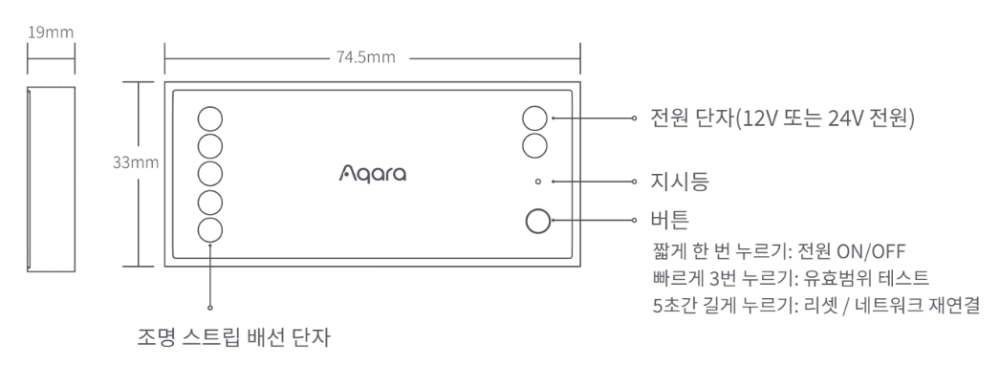

# 2 스마트 허브 E1

<figure><figcaption></figcaption></figure>

### 제품 소개

> Aqara 스마트 허브 E1은 USB포트로 전력을 공급하고 Zibee 3.0 프로토콜을 지원하는 최신 스마트 허브입니다. 스마트 허브 E1은 크기가 작아 유연한 설치가 가능하며, USB포트가 있는 콘센트와 다양한 기기에 연결하여 사용할 수 있습니다. 또한 하위 장치의 데이터 전송을위한 WiFi 중계 기능을 탑재하고 있습니다.



### 제품 사양

| 제품명     | 스마트 허브 E1                 |
| ------- | ------------------------- |
| 모델명     | HE1-G01                   |
| 제품 크기   | 108 x 30 x 8 mm           |
| 입력 전원   | 5V / 0.5A                 |
| 무선 프로토콜 | Zigbee 3.0 / WiFi 2.4 GHz |
| 작동 온도   | -10°C \~ 40°C             |
| 작동 습도   | 0 \~ 95% RH / 비결로 조건      |

### 기본 기능

하위 장치 추가: 허브 추가를 완료한 후 하위 장치 설명서를 참조하여 추가해 주세요.

하위 장치 추가 완료된 경우 애플 홈킷을 지원하는 하위 장치가 홈킷에 자동으로 동기화 하며, 애플 홈 앱을 통해서 확인할 수 있습니다.

본 제품은 핫스팟 기능을 지원하기 때문에 Wi-Fi 중계 기기로 사용할 수 있습니다. 앱에서 중계 기능을 켜두면 기본 SSID 비밀 번호를 수정할 수 있으며, 최대 4Mbps 데이터 전송을 지원하고 최대 2개의 Wi-Fi기기에 접속할 수 있습니다. 카메라, 도어락, 허브 등과 같은 Aqara 하위 제품의 경우 하나만 연결할 것을 권합니다.

* 허브가 각 하위 장치와 안정적으로 통신하기 위해 허브를 하위 장치가 있는 영역의 중심 위치에 설치하는 것이 좋습니다.
* 실내에 벽 등 장애물이 없는 경우를 기준으로 허브와 하위 장치간의 통신 거리는 최대 30미터입니다.



### 주의 사항

* 본 제품은 어린이가 사용할 경우 위험할 수 있으므로. 어린이의 손이 닿지 않는 곳에 두십시오.
* 본 제품은 실내 사용 용도로 설계되었습니다. 습한 환경이나 실외에서 사용하지 마십시오.
* 비바람에 노출된 장소, 물이 튀는 곳에 설치하지 마세요. 물 또는 액체류를 제품에 엎지를 경우 고장, 감전 및 화재의 위험이 있습니다.
* 본 제품을 열원 부근에 놓지 마십시오. 환기가 잘 되지 않는 밀폐된 공간에서 사용하지 마십시오.
* 본 제품을 임의로 분해, 수리, 개조하지 마십시오. 수리가 필요한 경우 support@aqara.kr로 연락 주십시오.
* 본 제품은 생활의 편리 및 편의성을 개선하기 위한 용도로 적합합니다. 가정. 건물, 창고 또는 다른 장소의 방범 용도로 사용하는 것을 권장하지 않습니다. 사용자가 상기 사용 지침을 따르지 않고 해당 제품을 사용할 경우 발생하는 어떠한 위험 및 재산 손실에도 제조사는 귀책이 없음을 알려 드립니다.
* 일반적인 사용 상황에서 본 제품과 사용자의 신체 사이에 최소 20cm 이상의 거리를 유지해야 합니다.





### 설치 전 확인 사항

* Wi-Fi 또는 데이터 통신 방식을 지원하는 스마트폰이나 태블릿이 필요합니다. (iOS, Android 모두 가능)
* Wi-Fi에 연결이 되어 있고 네트워크 연결이 안정적인지 확인해 주세요.

### 제품 설치

* 먼저 전원을 공급할 수 있는 USB 포트에 허브를 연결한 후 노란 불이 빠르게 깜박일 때까지 기다려 주세요. 휴대폰이 2.4GHz 밴드의 Wi-Fi 네트워크에 연결되어 있는지 확인해 주세요.
* 휴대폰은 허브에 최대한 가까이 위치한 뒤 연결해 주시고 휴대폰이 허브와 동일한 Wi-Fi 네트워크에 있는지 확인하십시오.

### Aqara Home 앱 연동

앱 스토어에서 “Aqara Home”을 검색해서 다운로드해주세요.

#### 허브 등록 하기

* 아카라홈 앱 첫화면에서 오른쪽 상단의 ’+’를 클릭하고 ’스마트 허브 E1’을 선택한 뒤 안내 사항에 따라 허브를 추가해주세요.
* 홈킷 연결하기: 애플 홈 안내에 따라 허브에 있는 홈킷 설정 코드를 스캔하시거나 수동으로 코드를 입력해주세요. 성공적으로 추가되는 경우 애플 홈 앱에서 추가된 허브를 확인하실 수 있습니다. 설정 코드는 반드시 보관해주세요.
* 실패하는 경우 허브를 10초간 길게 눌러 네트워크를 재설정한 후 앱에서 다시 추가를 진행해 주세요.



### 지시등 상태 설명

| 지시등 상태         | 장치 상태                       |
| -------------- | --------------------------- |
| 노란색 지시등 점등     | 전원인가 상태                     |
| 노란색 지시등 빠르게 점멸 | 네트워크 연결 대기 중                |
| 파란색 지시등 빠르게 점멸 | 네트워크 연결 중                   |
| 파란색 지시등 천천히 점멸 | 네트워크에 성공적으로 연결되었고 계정 연동중    |
| 파란색 지시등 점등     | 정상 동작 중                     |
| 흰색 지시등 점등      | 시작 후 10분동안 네트워크가 연결되어 있지 않음 |
| 보라색 지시등 점멸     | 액세서리(서브 디바이스) 추가 가능함        |
| 노란색 지시등 천천히 점멸 | 펌웨어 업그레이드                   |
| 꺼짐             | 지시등 꺼져 있음/ 장치 전원이 켜져 있지 않음  |



