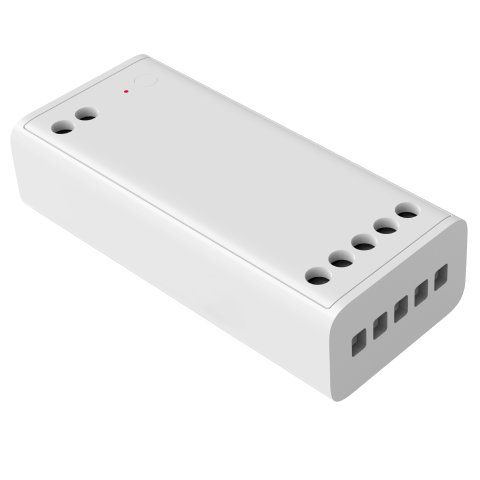

---
layout:
  title:
    visible: true
  description:
    visible: false
  tableOfContents:
    visible: true
  outline:
    visible: true
  pagination:
    visible: false
---

# LED 스트립 드라이버

<figure><figcaption></figcaption></figure>

### 제품 소개

> 아카라 스마트 LED 스트립 드라이버는 LED 스트립 조명의 전원을 제어하고 조명의 밝기, 색상, 색온도를 조절할 수 있는 조명 드라이버입니다. 장치의 모드를 전환하여 RGBW/CCT 스트립을 지원할 수 있습니다. Aqara 스마트 허브와 함께 사용하여 앱을 통해 스트립 조명의 상태를 원격으로 제어하거나 타이머를 설정할 수 있습니다. 또한 스마트 큐브, 무선 노브 스위치 등과 함께 사용하여 조명의 밝기와 색온도를 조절하는 등 다양한 형태로 편리하게 조명을 조절할 수 있습니다.



<figure><figcaption></figcaption></figure>

### 제품 사양

| 제품명     | LED 스트립 드라이버                 |
| ------- | ---------------------------- |
| 모델명     | ZNDDMK11LM                   |
| 입력 전압   | 12V 또는 24V                   |
| 출력 전류   | 최대 12A(총), 최대 6A(단일)         |
| 출력 전력   | 최대 144W@DC12V, 최대 288W@DC24V |
| 제품 크기   | 74.5 x 33 x 19 mm            |
| 작동 온도   | ta:40°C, tc: 75°C            |
| 작동 습도   | 0 \~ 95% RH / 비결로 조건         |
| 무선 프로토콜 | Zigbee 3.0                   |



### 주의 사항

* 본 제품은 실내 사용 용도로 설계되었습니다. 습한 환경이나 실외에서 사용하지 마세요.
* 비바람에 노출된 장소, 물이 튀는 곳에 설치하지 마세요. 물 또는 액체류를 제품에 엎지를 경우 고장, 감전 및 화재의 위험이 있습니다.
* 본 제품을 열원 근처에 두지 마세요.
* 본 제품은 주전원에 직접 연결할 수 있는 제품이 아니므로 적절한 전원 공급 장치를 사용하여 구동해 주세요.
* 본 제품을 다른 유형의 조명 스트립에 ㅔ연결하여 사용하는 경우 장치 모드를 전환해야 합니다.
* 본 제품은 Zigbee 3.0 통신 방식으로 작동하는 스마트 허브와 함께 사용해야 합니다.
* 일부 기능을 사용하기 위해서는 특정한 허브가 필요할 수 있습니다.



### 설치 전 확인 사항

주의: 절대로 전원이 켜진 상태에서 제품을 설치하지 마세요

### 제품 설치

(1) 설치 전 전원을 차단하고 중성선과 전원선을 전원 공급 장치의(별도 구매) N홀과 L홀에 각각 연결해 주세요.

<figure><figcaption></figcaption></figure>

(2) 도면을 따라 배선을 완료해 주세요. 전원 장치의 “+”와 “-”를 각각 드라이버 모듈의 “+” 홀과 “-”홀에 연결해 주세요. 조명 스트립의 배선은 다음 도면을 참조하세요.

RGBW 스트립 배선 가이드

CCT 스트립 배선 가이드

<figure><figcaption></figcaption></figure>

* 초기 장치는 RGBW모드로 설정되어 있으므로 CCT 스트립을 사용하는 경우 앱을 통해 모드를 변경해 주세요.

(3) 배선이 정확한지, 설치 환경에 안전 위험이 있는지 확인한 다음 전원을 연결해 주세요.

(4) 장치의 전원을 켠 후 빨간색 지시등이 천천히 깜빡이는 경우 네트워크 연결이 완료되지 않았음을 나타내며 아래 단계를 통해 연결을 완료할 수 있습니다. 지시등이 켜지지 않은 경우 버튼을 클릭하여 지시등의 변화를 확인하거나 배선을 다시 확인해 주세요.

### Aqara Home 앱 연동

앱 스토어에서 “Aqara Home”을 검색해 다운로드해주세요.

#### 장치 추가

(1) 아카라홈 앱을 열고 메인화면에서 우측 상단의 “+”를 눌러 “장치 추가” 페이지로 들어간 후 “Aqara 스마트 라이트스트립 드라이버”를 설치해 주세요.

* 장치와 허브 사이의 거리가 너무 먼 경우 장치 추가에 실패할 수 있습니다. 장치를 허브와 가까운 위치로 옮기고 다시 연결을 시도해 주세요.
* 유효 범위 테스트: 버튼을 빠르게 3번 누르면 허브에서 장치와 허브가 정상적으로 통신하고 있음을 안내합니다.

(2) 장치를 다른 모드로 사용해야 하는 경우 네트워크에 연결한 후 장치의 추가 설정에서 다른 모드로 전환해 주세요. 초기 장치는 RGBW모드로 설정되어 있으므로 CCT 스트립을 사용하는 경우 앱을 통해 모드를 변경해 주세요.



### 지시등 설명

| 지시등 상태                  | 장치 상태                      |
| ----------------------- | -------------------------- |
| 파란색 지시등 한번 점멸           | 전원 켜는 중                    |
| 빨간색 지시등 천천히 점멸          | Zigbee 네트워크 연결 실패          |
| 파란색 지시등 빠르게 점멸          | Zigbee 네트워크 연결 중           |
| 파란색 지시등과 빨간색 지시등 번갈아 점멸 | 장치 오프라인                    |
| 빨간색 지시등 빠르게 점멸          | 과열 및 과부하 경고                |
| 파란색 지시등 점등              | Zigbee네크워크에 연결 성공 / 정상 작동중 |



