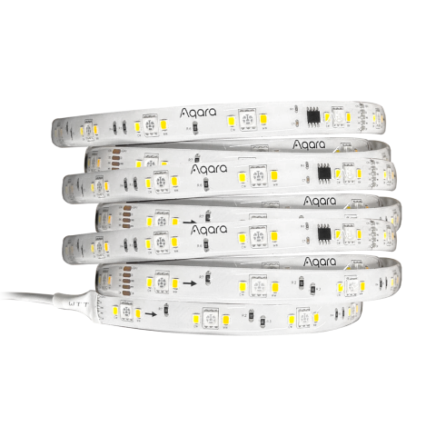

---
layout:
  title:
    visible: true
  description:
    visible: false
  tableOfContents:
    visible: true
  outline:
    visible: true
  pagination:
    visible: false
---

# LED 스트립 T1

<figure><figcaption></figcaption></figure>

### 제품 소개

> 아카라 LED 스트립 T1은 RGBIC 스트립으로 일정한 구간별로 다양한 색상을 표현할 수 있으며, 고품질의 백색 조명도 활용할 수 있어 다른 스마트 장치와 함께 사용하여 다양한 스마트홈 자동화 시나리오를 구현할 수 있습니다.
>
> 해당 제품의 기본 스트립 길이는 2m입니다. 스트립 연장을 원하시는 경우 별도의 연장 키트를 구매하여 사용하셔야 합니다. 스트립과 스트립을 잘 연결할 수 있도록 정렬하신 후에 버클로 연결 부위를 닫아 물리적으로 연결합니다. 이후 앱에서 장치 설정을 통해 연장한 스트립을 활성화하여 사용합니다.
>
> 

<figure><figcaption></figcaption></figure>



<figure><figcaption></figcaption></figure>

### 제품 사양

| 제품명       | LED 스트립 T1                                        |
| --------- | ------------------------------------------------- |
| 모델명       | LEDS-K01/LEDS-K02/RLS-K01D/RLS-K02D               |
| 스트립 크기    | L2000 x W12 x H2.8mm                              |
| 정격파워      | 5W/m(광원 30 x 5050 / 0.2 W/RGB, 광원 60 x 2835 0.2W) |
| 색상 및 색온도  | RGB + 2700K + 6500K                               |
| 무선 프로토콜   | Zigbee 3.0                                        |
| 정격 입력     | 100 \~ 240V / 60Hz / Max. 1.2A                    |
| 정격 출력     | 24 VDC 1.5A                                       |
| 스트립 정격 입력 | 24 VDC Max. 0.25 A/m                              |
| 작동 온도     | -10°C\~ 40°C                                      |
| 작동 습도     | 0 \~95% RH / 비결로 조건                               |



### 주의사항

* 해당 제품은 최대 10m 까지 직렬 연결 가능합니다.
* 수중, 인화성, 폭발성, 고온, 고습, 직사광선의 환경에 설치를 금지하며, 통풍이 잘 되는 환경에서 사용해야 합니다.
* 장치 사용 과정에서 제품이 손상되어서는 안되기 때문에 무거운 물건으로 제품을 누르거나 던지는 행위 등을 금지합니다. 전기적인 안전을 위해 금속 선으로 제품을 묶지 마세요.
* 스트립을 다른 물체로 감싸거나 덮어서 사용하지 마세요.
* 산성, 염가성 화학 물질이 스트립에 접촉되지 않게 해 주세요.
* 해당 제품은 출력 파워 24VDC, 1.5A SELV의 전원을 사용합니다.
* 스트립을 잘라서 사용하시는 경우 전원이 차단된 상태에서 제품에 표시된 위치를 따라 재단 하셔야 하고, 재단하고 남은 부분은 재사용 하지 마십시오.
* 해당 제품에 동봉동 코드는 파손시 교체가 불가능하므로 주의하여 사용해 주시기 바랍니다.
* 본 제품의 광원은 교체가 불가합니다. 개별 광원의 수명이 다한 경우 스트립 전체를 교체해야 합니다.





### 제품 설치

(1) 적합한 플러그를 선택하고 플러그를 전원 어댑터에 삽입한 다음 시계 방향으로 45° 돌립니다.

<figure><figcaption></figcaption></figure>

(2) 화살표에 따라 라이트 스트립과 컨트롤러를 연결합니다.

<figure><figcaption></figcaption></figure>

(3) 라이트 스트립을 설치할 표면을 청소하고 설치 표면을 평평하고 매끄럽고 건조하게 유지하고 라이트 스트립 뒷면의 3M 보호 용지를 떼어내고 라이트 스트립을 설치 표면에 붙인 다음 라이트를 누릅니다. 라이트 스트립이 단단히 붙혀졌는지 확인하기 위해 손으로 반복적으로 스트립을 벗기십시오

<figure><figcaption></figcaption></figure>

(4) 컨트롤러와 전원 어댑터를 연결하고 마지막으로 전원을 켭니다.

<figure><figcaption></figcaption></figure>

### Aqara Home 앱 연동&#x20;

앱 스토어에서 “Aqara Home”을 검색해 다운로드해주세요.

#### 장치 추가

아카라홈 앱을 열고 메인화면에서 우측 상단 “+”를 눌러 “장치 추가” 페이지로들어가 “LED 스트립 T1”을 선택합니다. 장치를 연결할 허브를 선택한 뒤에 앱의 안내에 따라 장치를 추가해 주세요.



