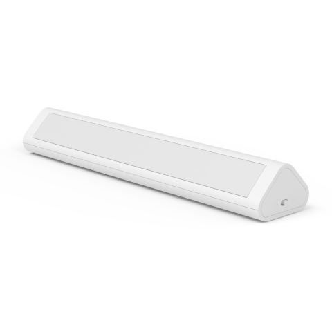

---
layout:
  title:
    visible: true
  description:
    visible: false
  tableOfContents:
    visible: true
  outline:
    visible: true
  pagination:
    visible: false
---

# 스마트 무선 센서등

<figure><figcaption></figcaption></figure>

### 제품 소개

> 아카라 스마트 무선 센서등은 어두운 공간에서 사람이나 동물의 움직임을 감지하면 자연스러운 조명이 약 15초 동안 점등됩니다.



<figure><figcaption></figcaption></figure>

### 제품 사양

| 제품명   | 스마트 무선 센서등           |
| ----- | -------------------- |
| 모델명   | GYXYD11LM            |
| 제품 크기 | 175 x 35 x 24 mmt    |
| 색온도   | 2700K                |
| 작동 습도 | 0 \~ 95% RH / 비결로 조건 |
| 배터리   | AA 배터리 2개            |
| 감지거리  | 5 \~ 6 M             |
| 감지 각도 | 좌우 120°, 상하 30°      |

### 기본 기능

#### 제품 기본 스펙

<figure><figcaption></figcaption></figure>

* 감지 각도: 좌우 120°, 상하 30°
* 감지 거리: 5 \~ 6 M
* 움직임이 감지되면 15초 동안 점등
* 하루 12회 작동 기준 6개월 이상 사용 가능
* 밝기 조절

<figure><figcaption></figcaption></figure>

#### 특징

<figure><figcaption></figcaption></figure>

#### 활용 예

한밤 중 불을 켜기 어려울 때 눈부심없이 안전하고 편리하게 스마트 무선 센서등을 활용할 수 있습니다.

<figure><figcaption></figcaption></figure>



### 주의 사항

* 본 제품은 장난감이 아닙니다. 이 제품을 아이의 손이 닿지 않는 곳에 두세요.
* 본 제품은 실내 사용 용도로 설계되었습니다. 습한 환경이나 실외에서 사용하지 마세요.
* 물기를 조심합니다. 물이나 다른 액체를 제품에 엎지르지 마세요.
* 본 제품을 열원 부근에 놓지 마세요. 제대로 환기되지 않는 곳에 놓지 마세요.
* 본 제품을 자체적으로 수리하려고 하지 마세요. support@aqara.kr에 연락하시기 바랍니다.
* 본 제품은 가정 생활의 오락, 편의성 및 메시지 알림을 개선하는 경우에만 적합합니다. 사용자가 제품 사용 지침을 위반하는 경우, 제조업체는 어떠한 위험 및 재산 손실에도 책임을 지지 않습니다.



### 제품 설치

(1) 철제 가구의 표면에 센서등을 붙여서 사요해 주세요. (제품 내에 자석이 내장되어 있습니다.)

(2) 설치를 희망하시는 장소에 제품 상자에 동봉된 철판을 부착해 주세요. 센서등 뒷면을 철판에 부착해 사용하실 수 있습니다.


