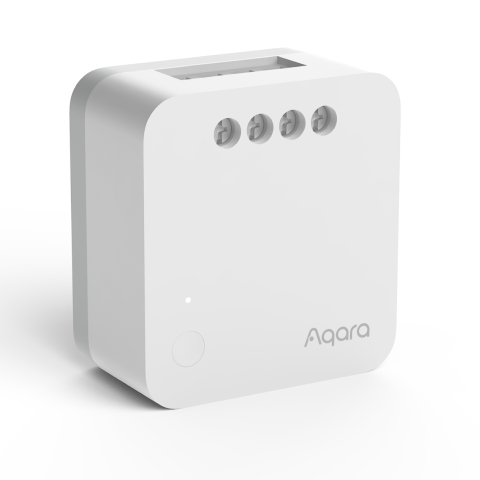

---
layout:
  title:
    visible: true
  description:
    visible: false
  tableOfContents:
    visible: true
  outline:
    visible: true
  pagination:
    visible: false
---

# 싱글 스위치 모듈 T1 (중성선)

<figure><figcaption></figcaption></figure>

### 제품 소개

> 아카라 싱글 스우치 모듈 T1(중성선 포함)은 Zigbee 3.0 무선 통신 프로토콜을 기반으로 한 중계 제어 모듈로, 조명, 선풍기 및 기타 기기의 켜기/끄기 상태를 제어할 수 있습니다. 아카라 허브와 함께 사용하면 앱을 통한 원격 제어, 타이밍 제어, 전력 감지, 전력 소비 통계 등을 실현할 수 있으며, 다른 스마트 기기와 매치하여 더 많은 스마트 시나리오를 실현할 수 있습니다.


* 본 제품은 아카라 허브가 필요합니다.
* 이 제품은 실내 전용 제품입니다.



한번 누르기: 켜기/끄기

8초 동안 길게 누르기: 재 설정 및 네트워크 연결

세번 누르기: 유효 범위 테스트

* 외부 스위치가 연결되면, 5번 켜고 끄면 네트워크 연결상태에 들어갑니다.




<figure><figcaption></figcaption></figure>

### 제품 사양

| 제품명            | 싱글 스위치 모듈 T1 (중성선)                          |
| -------------- | ------------------------------------------- |
| 모델명            | SSM-U01                                     |
| 제품크기           | 42.9 x 40 x 19.9 mm                         |
| 무선 프로토콜        | Zigbee 3.0                                  |
| 정격 전원          | 100-250VAC,최대 10A,50/60Hz, 최대 2500W(부하저항),μ |
| 작동 온도          | 0 \~ 35°C                                   |
| Zigbee 작동 주파수  | 2405-2480 Mhz                               |
| Zigbee 최대 출력전력 | ≤ 13 dBm                                    |



### 주의 사항

* 장치가 작동 중일 때는 가리지 마십시오.
* 장치를 제거하기 전에 전원 공급의 주 스위치가 꺼져 있는지 확인하십시오.
* 연속적으로 연결하지 마십시오.
* 이 제품은 장난감이 아닙니다. 이 제품에서 어린이를 멀리 유지하십시오.
* 이 제품은 실내 사용을 위해 설계되었습니다. 습기가 많은 환경이나 야외에서 사용하지 마십시오.
* 습기에 주의하십시오.
* 제품에 물이나 기타 액체물을 엎지 마십시오.
* 이 제품을 열원 근처에 두지 마십시오. 통풍이 정상인 경우에만 제품을 보관하십시오.
* 자체적으로 이 제품을 수리하려 하지 마십시오. 모든 수리는 공인 전문가에 의해 수행되어야 합니다
* 이 제품은 가정 생활의 품질을 향상시키고 장치 상태를 알려주기 위한 것입니다.
* 사용자가 제품 사용 지침을 위반하는 경우 제조업체는 어떠한 리스크 및 재산 손실에 대해서도 책임지지 않습니다.



### 설치 전 확인 사항

설치 전에 전원 공급의 주 스위치가 꺼져 있는지 확인하십시오.

### 제품 설치

장치가 전원을 켠 후에는 모든 도체(안테나 포함)가 강한 전기와 연결될 수 있습니다. 제품이 손으로 닿을 수 없는 보호 환경에 고정적으로 설치되어 있는지, 스위치 패트리스와 전구의 보호 커버와 같은 환경에 있는지 확인하십시오.

과부하하지 마십시오. 제품이 전원을 켜기 전에 이 제품의 전단에 있는 10A 과전류 보호 회로 차단기가 정상적으로 작동하는지 확인하십시오. 단자 배선의 권장 벗기 길이: 6\~8 mm.

요구 사항에 따라 다음 중 하나의 방법으로 전선을 연결하십시오.

**방법 1:** L1은 부하 전선에 연결됩니다. S0 및 S1은 외부 스위치의 두 끝에 각각 연결됩니다. L은 라이브 전선에 연결되고, N은 중성 전선에 연결됩니다 (아래 그림).

<figure><figcaption></figcaption></figure>

**방법 2:** L1은 부하 전선에 연결됩니다. 외부 스위치의 한쪽 끝이 S0에 연결되고, 다른 한쪽 끝이 라이브 전선에 연결됩니다. L은 라이브 전선에 연결되고, N은 중성 전선에 연결됩니다 (아래 좌측 그림). 외부 스위치가 이중 제어 스위치인 경우, 원래 스위치의 부하 전선에 연결된 끝은 S0에 연결하여 외부 이중 제어를 실현할 수 있습니다 (아래 우측 그림).

<figure><figcaption></figcaption></figure>

1. 도체의 최대 단면적은 2.5mm²입니다.
2. 외부 스위치가 연결되지 않은 경우, S0 및 S1은 휴지 상태로 남겨둘 수 있으며, 자동화 또는 앱을 통해 장치를 제어할 수 있습니다.

(2) 단일 스위치 모듈은 장치에 고정적으로 내장되어 있으며(예: 펜던트 램프 및 스위치 패트리스), 우발적인 접촉으로 인한 위험을 피하기 위해 이렇게 설치되어야 합니다.

<figure><figcaption></figcaption></figure>

(3) 고정 안테나를 붙여 주세요.

* 안테나의 내부 도체는 강한 전기와 연결되어 있습니다. 일상 생활에서 접촉될 수 있는 환경에 두지 마십시오. 만약 손상되었다면 만지지 말고 즉시 교체하거나 수리하십시오.
* 제어 모듈이 스위치 패트리스에 설치될 때, 안테나는 플라스틱 패트리스의 측면 벽에 붙이고 벽과 평행하게 유지하는 것이 권장됩니다. 스위치 패널 지지대가 플라스틱으로 만들어진 경우, 안테나는 벽에서 최대 10mm 떨어져 있어야 합니다. 스위치 패널 지지대가 금속으로 만들어진 경우, 안테나는 벽에서 15mm 이상 떨어져 있어야 합니다(금속 지지대).
* 만약 금속 패트리스에 설치된 경우, 안테나는 플라스틱 스위치 패널 내부에 부착하는 것이 권장되지만, 패널에는 충분한 공간이 필요합니다.
* 부착 위치는 금속, 전선 및 모듈 자체를 피하도록 노력해야 합니다. 천장이나 조명 내부에 설치된 경우 안테나는 지나치게 차단되지 않도록 주의해야 합니다.
* 안테나를 강하게 누르거나 굽히거나 끌어당기지 마십시오. 그렇게 하면 안테나가 손상될 수 있습니다.

(4) 주 전원 스위치를 켜고, 모듈이나 외부 스위치의 버튼을 누르십시오. 장치를 정상적으로 켜거나 끌 수 있다면, 이는 정상적으로 작동한다는 것을 나타냅니다.

### Aqara Home 앱 연동

앱 스토어에서 “Aqara Home”을 검색해 다운로드해주세요.

#### 장치 추가

* 허브 퀵 설치 가이드에 따라 허브를 앱에 추가해 주십시오.
* 아카라홈 앱을 열고 메인화면에서 우측 상단의 “+” 을 클릭하고 “장치추가” 페이지로 들어갑니다. “스위치 및 플러그” 탭에서 “싱글 스위치 모듈 T1(중성선 필요)”를 선택하고, 지시에 따라 추가합니다.
  * 연결이 되지 않는 경우, 액세서시를 허브에 더 가까이 이동시켜서 다시 시도해 주세요.

**유효 범위 테스트:** 원하는 위치에서 액세서리의 리셋 버튼을 3번 빠르게 누릅니다. 허브에 음성 프롬프트가 나타나는 경우, 액세서리가 허브와 유효하게 통신할 수 있다는 것을 나타냅니다.



### 지시등 상태 설명

| **지시등 상태**      | **장치 상태**         |
| --------------- | ----------------- |
| 파란색 지시등이 한번 점멸  | 장치 전원 켜기          |
| 파란색 지시등이 빠르게 점멸 | Zigbee네트워크 연결중    |
| 파란색 지시등이 점등     | Zigbee네트워크 정상 동작중 |
| 빨간색 지시등이 빠르게 점멸 | 고온 경보             |
| 빨간색 지시등이 천천히 점멸 | Zigbee네트워크가 끊긴 상태 |



