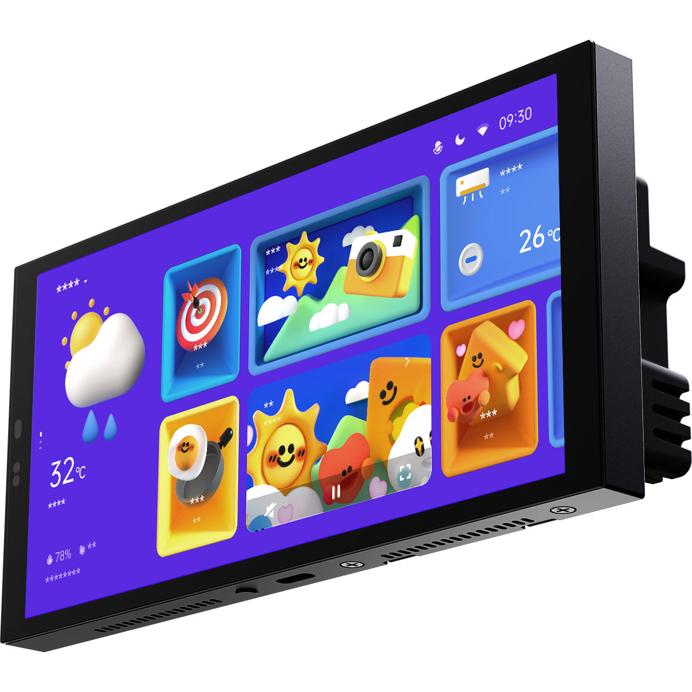

---
layout:
  title:
    visible: true
  description:
    visible: false
  tableOfContents:
    visible: true
  outline:
    visible: true
  pagination:
    visible: false
---

# 매직패드 S1 Plus

<figure><figcaption></figcaption></figure>

### 제품 소개

> 아카라 매직패드 S1 Plus는 3구 스위치 모듈이 결합된 디스플레이 패널입니다. 표준 86형 박스를 기준으로 쉽고 빠른 설치가 가능하도록 설계되었습니다. 최신 QIAO UI가 내장되어 있으며, 터치 스크린을 통해 모든 스마트 홈 장치와 자동실행/동시실행을 제어 할 수 있습니다.



### 제품 사양

| 제품명      | 매직패드 S1 Plus                                                             |
| -------- | ------------------------------------------------------------------------ |
| 모델명      | MP-K01D                                                                  |
| 제품크기     | 172 x 86 x43.7 mm                                                        |
| USB-C 입력 | 5V/2A                                                                    |
| 무선 프로토콜  | Wi-Fi IEEE 802.11 a/b/g/n/ac 2.4GHz/5Ghz, Zigbee IEEE802.15.4, Bluetooth |
| 해상도      | 1440 x 720                                                               |
| 정격 입력    | 00-240 V,50/60 Hz, _μ_                                                   |
| 정격 부하    | 최대, 2200W (백열등), 최대 400W(용량/LED등 유도부하)                                   |
| 작동 온도    | -10°C\~ 40°C                                                             |
| 작동 습도    | 0 \~95% RH / 비결로 조건                                                      |



### 주의 사항

* 본 제품은 전기 관련 전문 기술이 필요하므로, 전기기사 또는 기능사 자격증을 소지한 사람이 설치하여야 합니다. 안전을 위해서, 설치하기 전에 반드시 사용 설명서를 읽고 설치하여 주시기 바랍니다.
* 습기에 주의하시고, 본 제품에 물이나 액체를 흘리지 마세요.
* 본 제품은 유선 전원 연결 장치입니다. 스위치 모듈에 패널이 추가 결합되며, 스위치 모듈과 패널은 모두 전문가가 설치해야 합니다.
* 승인되지 않은 타사 소프트웨어로 장치의 펌웨어 및 시스템을 업데이트하면 장치를 사용할 수 없게 되거나 개인정보가 유출되는 등의 보안 위험이 발생할 수 있습니다. 반드시 아카라 공식 앱 안내를 따라 업데이트를 진행하세요.
* 화면 상단의 마이크 홀(구멍)이 막히면 오디오 품질이 저하됩니다. 마이크 홀을 막지 않도록 주의해 주세요.
* 본 제품을 직접 수리하려고 시도하지 마십시오. 모든 수리는 공인된 전문가가 수행해야 합니다.
* 본 제품은 실내 사용 용도로 설계되었습니다. 외부 환경 또는 비정상적인 온습도 상황에서 사용하지 마세요,
* 본 제품을 열원 근처에 두지 마세요,
* 날카로운 물체로 터치스크린을 긁지 마세요.



<figure><figcaption></figcaption></figure>

### 설치 전 확인 사항

설치하기 전에 주 전원 스위치가 꺼져 있는지 확인하세요.

* 설치 위치 선택: 제품이 Wi-Fi연결이 가능한 범위 내에 있는지 확인해 주세요.
* 장치와 라우터 간 권장 설치범위는 2\~6미터 이내입니다. 제품 근처에 장애물이나 전자파장애를 일으킬 수 있는 금속 장애물이 없는지 확인해 주세요.

<figure><figcaption></figcaption></figure>

### 제품 설치

(1) 포장 상자에서 제품 및 관련 부속품을 꺼냅니다.

(2) 매직패드 하단의 나사가 풀려있는지 확인하세요, 스위치 모듈을 매직패드와 분리한 후 스위치 베이스를 설치합니다. 드라이버를 이용해 뒷면의 나사를 풀어준 뒤, 활선과 중성선을 각각 장치의 구멍 L과 N에 연결합니다. 로드 와이어(조명)를 해당 구명 L1,L2, L3에 연결하세요. 배선이 올바른지 확인한 후 단자 나사를 조이세요. 3개 채널의 부하가 정격 전력을 초과하지 않도록 주의하세요.

* 참고용: 활선은 일반적으로 빨간색이고 중성선은 일반적으로 하얀색 또는 검정색입니다.
* 나사 토그는 0.7 Nm를 초고하지 않아야 합니다.

(3) 제공된 나사를 사용하여 스위치 베이스를 벽면 정면 박스에 고정합니다.

<figure><figcaption></figcaption></figure>

(4) 매직패드 하단의 나사가 느슨해 졌는지 확인하세요. 그런 다음 매직패드 상단을 스위치 모듈에 걸어 놓습니다. 장치 하단부를 아래로 누르고 나사를 조이세요.

* 브라켓 하단의 나사를 풀 때 나사가 빠지는 것을 방지하기 위해 무리한 힘을 가하지 않도록 주의하세요.

<figure><figcaption></figcaption></figure>

(5) 하단 나사를 고정한 후 장치의 전원을 켜세요. 시작이 완료될 때까지 기다린 다음 언어를 선택하고 바인딩 페이지로 들어갑니다.

<figure><figcaption></figcaption></figure>

<mark style="background-color:yellow;">Aqara 매직패드 S1 Plus와 iPhone, iPad, Apple Watch, HomePod, HomePod mini 또는 Mac등의 Apple 기기와의 통신에는 HomeKit 기술이 적용됩니다. Works with Apple로고의 사용은 이 제품이 로고에 표시된 기술과 연동하여 사용할 수 있도록 디장인 되었다는 것을 의미하며, Apple의 성능 기준이 부합함을 인정 받았다는 것을 의미합니다. Apple은 해당 제품에 대한 사용이나 이에 적합한 안전 기준에 책임을 지지 않습니다.</mark>

<mark style="background-color:yellow;">Apple, Apple Watch, HomeKit, HomePod, HomePod mini, Siri, iPad, iPad Air 및 iPhone은 미국 및 기타 국가에 등록된 Apple Inc.의 상표입니다.</mark>

### Aqara Home 앱 연동

앱 스토어에서 “Aqara Home”을 검색해 다운로드해주세요.

#### 장치 추가

* 연결을 위해 휴대폰을 장치에 최대한 가까이 가져 가세요. 또한 휴대폰과 장치가 모두 동일한 Wi-Fi 네트워크(2.4GHz 또는 5GHz)에 있는지 확인하세요.
* 아카라 홈 앱을 열고 메인 화면에서 우측 상단의 “+” 탭하여 “장치 추가” 페이지로 들어갑니다. “MagicPad S1 Plus”를 선택하거나 MagicPad에 있는 QR 코드를 스캔한 후 앱 안내에 따라 장치 추가를 완료하세요.
* 장치 추가에 실패하는 경우 아래의 사항을 확인해 주세요.
* Wi-Fi이름 또는 암호에는 @,#,%,-와 같은 특수 문자를 지원하지 않습니다. 일반 문자로 변경한 후 다시 시도해 주세요.
* 본 장치는 현재 WPA/WPA2 기업 수중 Wi-Fi 네트워크를 지원하지 않습니다.
* 라우터에 와이파이 무단 사용 방지 기능이 켜져 있다면 이를 끄고 시도하세요.
* 라우터가 AP 격리를 활성화했는지 확인하여 휴대폰이 LAN에서 장치를 검색할 수 없도록 합니다.
* 브리지 네트워킹은 권장하지 않습니다.
* 애플 홈킷 연결에 실패하는 경우 아래의 사항을 확인해 주세요.
* 액세서리 추가 실패 시 반복적인 실패로 인한 캐시 문제로 오류가 발생 할 수 있습니다. iOS 장비를 재부팅한 후 초기화하여 다시 시도하세요.
* 액세서리가 이미 추가 되었다는 메시지가 나오는 경우 iOS 장비를 재부팅하고 초기화한 후, HomeKit 설치 코드를 수동으로 입력해 다시 추가해 주세요.
* 액세서리 찾기 실패시 장비를 초기화하고약 3분 후에 HomeKit 설치 코드를 수동으로 입력하여 다시 추가해 주세요.

#### 초기화 방법

**네트워크 초기화**

매직패드를 성공적으로 추가한 후, \[설정]으로 이동하여 \[Aqara ID] -> \[로그아웃]을 선택하세요. 지침에 따라 장치를 네트워크에 다시 연결하세요.

**공장 초기화**

매직패드를 성공적으로 추가한 후 \[설정]으로 이동하여 \[고급 설정] -> \[공장 초기화]를 선택하세요. 화면의 지식에 따라 장치를 공장 설정으로 복원하고 모든 데이터를 삭제 하세요.

**장치 재시작**

패널을 성공적으로 추가한 후 시스템 설정 페이지로 이동하여 \[고급 설정] -> \[다시 시작]을 선택하세요. 화면의 지시에 따라 장치를 다시 시작하세요.

* 위 페이지의 제품 이미지와 디스플레이는 참고용입니다. 실제 제품(외형,색상, 크기 등)과 화면 표시 내용(배경,UI,그래픽 등)은 다소 다를 수 있습니다.
* 위 내용은 필요에 따라 별도의 통지 없이 변경 또는 조정 될 수 있습니다.


