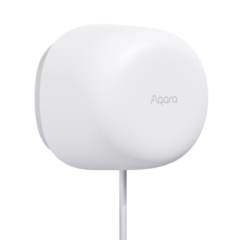

---
layout:
  title:
    visible: true
  description:
    visible: false
  tableOfContents:
    visible: true
  outline:
    visible: true
  pagination:
    visible: false
---

# 재실 감지 센서 FP1

<figure><figcaption></figcaption></figure>

### 제품 소개

> 재실 감지 센서 FP1은 사람 및 움직이는 사물의 조재 여부를 감지하는 센서로 재실 여부, 다가옴과 멀어짐, 좌우 움직임 방향, 실내에서의 위치 등을 감지 할 수 있습니다. 군사 및 우주 개발 분야에서 주로 사용되는 mmWave레이더 기술 적용으로 장시간 움직임 없는 사람의 재실 여부까지 정확히 감지합니다.


* 제품을 사용하기 위해서는 해당 제품을 지원하는 허브가 필요합니다. 일부 기능을 사용하기 위해서는 특정한 허브가 필요할 수 있습니다.
* FP1 초기화를 위해서는 제품 하단의 리셋 버튼을 5초간 길게 누르세요.




<figure><figcaption></figcaption></figure>

### 제품 사양

| 제품명     | 재실 감지 센서 FP1                               |
| ------- | ------------------------------------------ |
| 모델명     | PS-S01                                     |
| 무선 프로토콜 | Zigbee 3.0                                 |
| 입력 전원   | 5V / 1A                                    |
| 작동 온도   | -10°C \~ 40°C                              |
| 작동 습도   | 0 \~ 99% RH / 비결로 조건                       |
| 구성품     | 재실 센서 FP1 x 1, 사용 설명서 x 1, 스티커 x 1, 자석 x 1 |



### 주의 사항

* 본 제품은 어린이가 사용할 경우 위험할 수 있으므로, 어린이의 손이 닿지 않는 곳에 두십시오,
* 본 제품은 실내 사용 용도로 설계되었습니다. 습한 환경이나 실외에서 사용하지 마십시오.
* 비바람에 노출된 장소, 물이 튀는 곳에 설치하지 마십시오. 물 또는 액체류를 제품에 엎지를 경우 고장, 감전 및 화재의 위험이 있습니다.
* 본 제품을 열원 부근에 설치하거나 환기가 잘 되지 않는 밀폐된 공간에서 사용하지 마십시오.
* 본 제품을 임으로 분해, 수리, 개조하지 마십시오. 수리가 필요한 경우 support@aqara.kr로 연락하십시오.
* 본 제품은 생활의 편리 및 편의성을 개선하기 위한 용도로 적합합니다. 가정, 건물, 창고 또는 다른 장소의 방범 용도로 사용하는 것을 권장하지 않습니다. 사용자가 상기 사용 지침을 따르지 않고 해당 제품을 사용할 경우 발생하는 어떠한 위험 및 재산 손실에도 제조사는 귀책이 없음을 알려 드립니다.
* 일반적인 사용 환경에서, 본 장치를 인체로부터 20cm 이상 떨어뜨려 사용해 주세요.



### 설치 시 확인 사항

재실 센서 FP1은 공간 내의 움직이는 물체에 민감하게 반응합니다. 커튼, 선풍기,에어컨, 식물, 흐르는 물 등 움직임이 있는 물체들을 피해서 설치해야 합니다. 움직이는 물체를 피할 수 없는 경우에는 Aqara Home앱 내에서 간섭한 설정이 필요합니다.

### 제품 설치

#### 센서 감지 범위

수평각: 120°| 수직각: 40° | 최대 감지 거리: 5m(방사형 기준)

<figure><figcaption></figcaption></figure>

#### 추천하는 설치 위치

재실 센서 FP1을 설치할 위치의 높이와 각도를 조절하여 감지 범위를 조절할 수 있습니다. 넓은 범위를 감지하고자 하시는 경우에는 2-2.7m 사이의 높이에 설치하는 것을 추천하며, 활동 영역을 감지하기 위해 레이더 센서가 약간 아래 방향을 향하도록 설치해 주시는 것이 좋습니다.

(1) 천장에 설치하는 경우

강점: 정적인 사람이나 물체도 감지 가능(예: 수면 중에도 재실 여부 감지 기능)

약점: 감지 범위가 상대적으로 좁음

<figure><figcaption></figcaption></figure>

(2) 벽면에 설치

강점: 넓은 감지 범위, 움직이거나 앉아 있는 사람/물체 감지에 효과적

약점: 소파, 침대 등에 누워 있는 사람이나 물체를 감지하기 위해서는 정확한 인식을 위해 설치 위치와 각도를 조절해야 함. 수면중인 사람의 재실 여부를 감지하기 위해서는 침대 위의 천장에 설치하는 것을 추천합니다.

<figure><figcaption></figcaption></figure>

#### 설치 방법

감지가 필요한 영역에 따라 천장이나 벽면 등 설치할 위치를 선택해 주세요. 설치 위치를 결정한 후 USB-A 전원선을 어댑터 등 전원 장치에 연결해 주세요.

* 재실 센서가 사람을 정확히 인식하는지 확인하기 전에는 장치의 위치를 완전히 고정하지 않는 것을 추천합니다. 테이프 등을 이용하여 임시로 장치를 고정한 후 원하는 범위에서의 재실 여부가 정확하게 인식되는지를 먼저 확인해 주세요.

<figure><figcaption></figcaption></figure>

#### Aqara Home 앱 다운로드

앱 스토어에서 “Aqara Home”을 검색해 다운로드해주세요.

#### Aqara Home 앱에 장치 추가하기

(1) 스마트 허브 매뉴얼을 참고하여 스마트 허브를 Aqara Home앱에 추가해 주세요.

(2) 아카라홈 앱을 열고, 메인화면에서 우측 상단의 “+”를 선택하여 “장치 추가” 페이지에 들어 가세요. “재실 센서 F1”을 선택한 후 앱의 안내 사항에 따라 장치를 추가해 주세요.

#### 기능 설정하기

장치를 앱에 성공적으로 설치한 후 해당 장치를 선택하면 그림과 같이 좌표를 확인할 수 있습니다. 좌표 한 칸은 가로 1m x 세로 1m의 감지 영역을 의하며, 총 28칸의 그리드로 구성되어 있습니다. 감지 영역에 직접 들어가고 나오거나 서 있는 위치를 이동하여 재실 감지 및 위치 확인 기능이 정상적으로 작동하는지 확인해 주세요. 확인 후 장치가 정상적으로 재실 여부를 감지한다면 해당 위치에 스티커를 이용하여 자석 스탠드를 고정해 주세요. 정상적으로 감지하지 못하는 경우에는 센서의 위치, 각도, 간섭원 등의 설정을 변경하여 정상적으로 감지할 때까지 테스트를 진행해 주세요.

(1) 구역 감지: 침대,TV 등 공간 내 설치된 사물의 배치에 따라 감지 구역을 설정하고, 감지 상황을 시각적으로 구현할 수 있습니다.

<figure><figcaption></figcaption></figure>

(2) 두가지 감지 모드: 전체 감지, 좌우 감지 두가지 옵션 중 원하는 감지모드로 인체 상태를 감지 할 수 있습니다.

<figure><figcaption></figcaption></figure>

(3) 간섭원 설정 기능: 감지구역에서 신호에 영향을 주는 간섭원을 미리 설정하여 보다 정확한 데이터로 사용자 맞춤형 시나리오를 구현할 수 있습니다.\

<figure><figcaption></figcaption></figure>

#### 자동화 설정 조건

재실 센서 FP1은 다양한 자동화 조건을 지원합니다. 아래의 내용을 참고하여 자동화를 설정해 주세요.

(1) 사람이 있을 때(재실): 6초 이상 연속적으로 사람이나 물체가 감지되는 경우 사람이 존재하는 것으로 판단합니다.

(2)일정 시간 이상 사람이 있을 때 일정한 시간 이상 재실 상태가 유지되는 경우를 트리거로 사용할 수 있습니다. 예를 들어 사람이 화장실에서 미끄러 넘어져 방치되는 것 등을 막기 위해 너무 긴 시간 재실 상태가 유지될 경우 경고 알람을 주는 용도로 활용할 수 있습니다.

(3) 사람 없음: 30초 이상 사람이나 물체의 움직임이 감지되지 않는 경우 부재로 간주하며, 주변 환경 조건에 따라 부재로 인식하는 시간의 결정에 다소 차이가 발생할 수 있습니다. 만약 부재 상태가 정확하게 감지도지 않는 경우 감지 범위 내에 간섭원이 없는지 확인해 주세요.

(4) 일정 시간 이상 사람이 없을 때: 해당 조건은 일정 시간 동안 감지 영역내에 사람이 없는 경우 자동화를 구성하는 데 사용할 수 있습니다.

(5) 사람이 감지 범위에 들어 올때: 해당 조건은 즉각적으로 판단합니다. 좌우 영역 감지를 활성화 시키는 경우 “왼쪽으로 들어 올 때”, “오른쪽으로 들어 올 때” 두가지 상태를 감지합니다.

(6) 사람이 감지 범위에서 떠날 때: 사람 없음을 인식하는 판단 기준과 마찬가지로, 30초 이상 재실 여부가 감지되지 않는 경우 사람이 감지 범위에서 떠나는 것으로 인식합니다. 좌우 영역 감지를 활성화 시키는 경우, “왼쪽으로 떠남” 과 “오른쪽으로 떠남” 두 가지 상태를 감지합니다.

* 참고: 영역 감지의 경우, 사람이 떠나는 것을 즉시 판단합니다.

(7) 사람이 다가오거나 멀어질 때: 센서를 기준으로 다가오는지 멀어지는지를 판단하며 1m, 2m,3m 단위로 설정할 수 있습니다. 해당 조건을 통해 다가오거나 멀어지는 거리에 따라 조명의 밝기를 조절하는 자동화를 구현할 수 있습니다.

(8) 영역 감지: 특정한 영역을 설정한 후, 해당 영역을 기반으로 자동화 옵션이 생성됩니다. 생성된 영역을 기준으로 자동화 옵션이 생성됩니다. 생성된 영역을 기준으로 사람이 있을 때와 없을 때, 사람이 들어오거나 나갈 때 4가지 조건의 자동화를 설정 할 수 있습니다.

#### 해당 장치는 센서 범위내의 전체 감지와 설정한 일부 영역에 대한 감지가 가능합니다.

Aqara Home 메인 화면에서 장치를 설정한 후 “영역 설정”을 누르면, 감지 영역과 기타 구역을 설정할 수 있습니다. 사용 환경에 따라 화장실, 소파, 식사 공간 등 최대10개의 영역을 설정할 수 있습니다. 설정한 영역은 Aqara Home 앱에서 해당 장치를 선택하면 확인할 수 있으며 추후 편집이나 삭제가 가능하고 자동화 조건으로 사용할 수 있습니다. 또한 감지를 원하지 않는 지역에 출입구, 간섭원, 가장자리 중 하나를 설정할 수 있습니다. 간섭원을 설정하는 경우 커튼, 선풍기, 식물 등으로 움직이는 물체로 인해 발생하는 잘못된 인식을 줄일 수 있습니다. 또한 출입구와 가장자리를 미리 설정하는 경우 전파 간섭으로 인한 다중 경로 효과를 줄여 보다 정확한 감지가 가능합니다.

#### 추천하는 설치 위치

추가설정에서 공간 꾸미기, 감지 모드, 접근 감지 거리 등을 설정할 수 있습니다. ‘공간 꾸미기’에서 최대 10개의 아이콘을 추가하여 해당 영역을 보다 직관적으로 확인 할 수 있습니다. 침대, 식탁, 소파 등의 기본 아이콘을 선택한 후 사이즈를 변경하거나 회전하거나 삭제할 수 있습니다. ’감지 모드’에서는 전체 영역을 감지하는 ’전체 감지’ 또는 방향성을 함께 감지하는 ’좌우 감지’를 선택할 수 있습니다. 기본 설정은 전체 감지로 설정되어 있으며해당 경우에는 좌측이나 우측의 이도을 감지하지 못합니다. 좌우 감지가 활성화된 경우에는 해당 조건을 기반으로 자동화를 설정할 수 있습니다(사람이 왼쪽에서 들어 올때, 사람이 오른쪽에서 들어올 때,사람이 왼쪽으로 나갈때, 사람이 왼쪽으로 나갈 때 등). ’민감도’의 경우 사용 환경에 따라 강/중/약 3 단계로 설정할 수 있습니다. ’사람 없음 상태로 초기화’의 경우 간섭원에 의해 사람이 있는 것으로 잘못 인식한 경우 눌러서 상태를 리셋할 수 있습니다. ’접근 감지 거리’의 경우 1m, 2m, 3m로 설정할 수 있습니다.

<figure><figcaption></figcaption></figure>



### 지시등 상태 설명

| 지시등 상태          | 장치 상태                                                                                               |
| --------------- | --------------------------------------------------------------------------------------------------- |
| 파란색으로 세번 깜빡임    | Zigbee 네트워크 검색 시작                                                                                   |
| 2초 마다 파란색으로 깜빡임 | Zigbee 네트워크 검색 중                                                                                    |
| 파란색으로 두 번 깜빡임   | <ul><li>전원 공급 성공</li><li>Zigbee 네트워크 연결 성공</li><li>Zigbee 장치 검색 성공</li><li>Zigbee 네트워크 리셋</li></ul> |
| 파란색으로 1초 동안 깜빡임 | 네트워크 연결 실패                                                                                          |
| 파란색으로 한 번 깜빡임   | 장치 리셋 실패                                                                                            |


