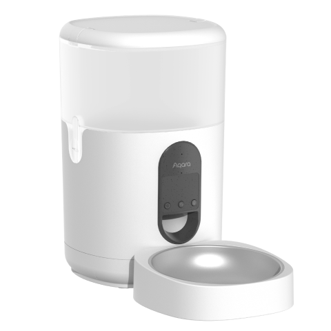

---
layout:
  title:
    visible: true
  description:
    visible: false
  tableOfContents:
    visible: true
  outline:
    visible: true
  pagination:
    visible: false
---

# 스마트 자동 급식기 C1

<figure><figcaption></figcaption></figure>

### 제품 소개

> 아카라 스마트 자동 급식기 C1은 Zigbee 3.0 통신 방식으로 작동하는 반려 동물 자동 급식기로, 언제 어디서나 정해진 시간에 설정한 양의 사료를 반려 동물에게 급여할 수 있습니다.


본 제품을 사용하기 위해서는 Zigbee 3.0을 지원하는 아카라 스마트 허브가 필요합니다.




### 제품 사양

| 제품명     | 스마트 자동 급식기 C1                                                                                |
| ------- | -------------------------------------------------------------------------------------------- |
| 모델명     | 
PETC1-M01

(PET - Products for pets, C-Care series, M01-First motorized product)
 |
| 제품 크기   | 193 x 193 x 312 mm                                                                           |
| 무선 프로토콜 | Zigbee IEEE 802.15.4 (라우터/중계기 사용)                                                            |
| 제품 색상   | 흰색                                                                                           |
| 정격 전류   | 1A                                                                                           |
| 정격 전압   | 5V                                                                                           |
| 작동 온도   | -10°C\~45°C                                                                                  |
| 작동 습도   | 0\~95% RH / 비결로 조건                                                                           |
| 구성품     | 스마트 자동 급식기 C1 x 1, USB케이블 x 1, 푸드 트레이 x 1, 플라스틱 그롯 x 1, 제습제 x 1                              |



### 주의 사항

* 이 기기는 8세 이상의 어린이와 신체적, 감각적 또는 정신적 능력이 떨어지거나 경험 및 지식이 부족한 분이 사용할 수 있습니다. 다만, 안전하게 기기 사용을 할 수 있도록 교육을 받고 관련 위험을 이해한 다음에 사용해야 합니다.
* 어린아이가 기기를 가지고 놀지 않도록 주의해 주세요.
* 보호자의 감독 없이 어린아이가 기기를 청소하거나 관리하지 않도록 주의해 주세요.
* 장치의 표시에 해당하는 안전 초저전압에서만 공급해야 합니다.

**(참고)**

* 다른 유형의 배터리 또는 새 배터리와 사용된 배터리를 혼합하여 사용하지 마십시오.
* 배터리 컴파트먼트에 표시된 대로 배터리를 올바른 극성으로 삽입하십시오.
* 재충전할 수 없는 배터리는 충전시키지 마십시오.
* 환경 오염 방지를 위해 사용한 배터리는 분리하여 배출해 주세요.
* 장치를 오랫동안 사용하지 않을 시 배터리를 제거해야 합니다.
* 전원 공급 단자는 단락되지 않아야 합니다.
* 방전된 배터리는 장치에서 분리하여 안전하게 폐기해야 합니다.



<figure><figcaption></figcaption></figure>

### 설치 전 확인 사항

* Wi-Fi 또는 모바일 네트워크에 연결할 수 있는 스마트폰 또는 태블릿 기기(iOS, Android 모든 가능)
* Zigbee 3.0을 지원하는 아카라 스마트 허브
* 전원 공급 장치: 5V1A USB-A 콘센트 또는 충전 어댑터
* 아카라 홈앱
* 동봉된 제습제를 뚜껑의 제습제 슬롯에 넣어 주세요.
* 건식 사료를 사료통에 넣어 주세요.

(참고)

* 2-12mm 이내의 건식 사료만 급여할 수 있습니다.
* 건식 사료 급여가 가능한 3개월 이상의 반려 동물에게 사용을 권장합니다.
* 건식 사료만 사용할 수 있으며, 습식 자료와 함께 사용할 수 없습니다.
* 급식기가 넘어지는 경우 위험할 수 있으므로 벽에 기대어 고정해서 사용하는 것을 권장하며 반려 동물의 안전을 위해 테이블, 의자 또는 기타 가구에서 먼 곳에 설치해 주세요.

### Aqara Home 앱 연동

앱 스토어에서 “Aqara Home”을 검색해 다운로드해주세요.

#### 장치 추가

* 해당 제품을 사용하기 위해서는 Zigbee 3.0을 지원하는 아카라 스마트 허브가 필요합니다. 스마트 허브 설명서에 따라 허브를 앱에 추가해 주세요.
* 아카라홈 앱을 열고 메인 화면에서 우측 상단의 ‘+’를 눌러 ’장치 추가’ 페이지로 이동해 주세요. ’스마트 자동 급식기 C1”을 연결할 허브를 선택하고 앱의 안내 사항에 따라 장치를 추가해 주세요. 리셋 버튼을 5초간 누르면 허브와 연결됩니다.

추가 환경 설정

‘스마트 자동 급식기 C1’ 을 성공적으로 설치한 후 장치 아이콘을 눌러 우측 상단의 ’…’를 누르시면 급여 계획, 어린이 사용 방지 등의 세부 사항을 설정할 수 있습니다.

#### 전원 공급 방법

* 일반적인 사용 환경에서는 전원 어댑터를 통해 급식기에 전원을 공급해 주세요.
* 건전지를 이용하여 스마트 자동 급식기 C1을 사용할 수 있습니다. 제품 하단부의 배터리 커버를 열어 배터리를 교체해 주세요. 단, 배터리로 사용하는 경우 정전 발생 시 전원 공급을 보장 할 수 없습니다.
* 건전지는 제품에 포함되어 있지 않으며, D형 배터리(LR20)가 필요합니다.
* 건전지로 사용하는 경우 에너지 절약을 위해 제품의 지시등이 꺼지지만 장치는 정상적으로 동작합니다.




### 기본 기능

#### 사료통 청소하기

사료통 양 옆의 연결부를 눌러 사료통을 분리한 후 사료통을 청소 할 수 있습니다.

참고: 장치의 하단부를 물로 세척하는 경우 고장이 발생할 수 있으므로 삼가해 주세요.

#### 장치 사용 방법

| 기능                     | 사용 방법                                                                                                                                                                                                                                                                                        |
| ---------------------- | -------------------------------------------------------------------------------------------------------------------------------------------------------------------------------------------------------------------------------------------------------------------------------------------- |
| 1회 급여하기                | 
[급식 버튼]을 한번 누르면 1회 급여가 가능합니다. 급여량은 앱에서 설정할 수 있습니다.

참고: 1회분의 중량은 약 6~10g으로 사료의 크기에 따라 달라질 수 있습니다. 반려 동물의 선호도와 실제 사료 중량을 확인하여 급십량을 설정해 주세요.
                                                                                                                                       |
| 음성 녹음하기                | \[음성 녹음 버튼]을 길게 누르면 ‘삐’ 소리가 난 후 녹음이 시작 됩니다. 손을 떼면 ‘삐,삐’ 소리와 함께 녹음이 종료되고, 최대 12초까지 녹음할 수 있습니다.                                                                                                                                                                                                |
| 
연결상태

확인하기
 | \[리셋 버튼]을 누른 후 지시등이 파란색으로 세번 깜빡거리면 장치가 정상적으로 네트워크에 연결된 것을 의미합니다. 지시등이 약 1초가 빨간색으로 켜진 경우 장치가 네트워크에 연결되어 있지 않음을 의미합니다.                                                                                                                                                                         |
| 공장초기화 및 네트워크 설정하기      | 
지시등이 파란색으로 바뀌고 계속 깜빡거릴 때까지 리셋버튼을 5초가 길게 눌러 주세요. 장치가 공장 초기화 되고 네트워크를 설정합니다. 네트워크 설정은 30초 동안 아래와 같은 상태로 진행됩니다.
<ul><li>아카라홈 앱에서 네트워크가 정상적으로 설정되는 경우 지시등의 깜빡임이 멈추게 됩니다.</li><li>네트워크 설정에 실패하는 경우 빨간색 지시등이 짧게 깜빡이다가 꺼집니다.</li><li>다른 추가 작업이 없는 경우 30초 후 지시등이 꺼지고 네트워크 연결이 종료됩니다.</li></ul> |



