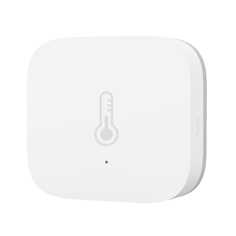

---
layout:
  title:
    visible: true
  description:
    visible: false
  tableOfContents:
    visible: true
  outline:
    visible: true
  pagination:
    visible: false
---

# 온습도 센서 T1

<figure><figcaption></figcaption></figure>

### 제품 소개

> Aqara 온도 및 습도 센서는 실시간으로 실내 온도, 습도 및 기압을 모니터링하고 기록합니다. 현재 및 과거 데이터를 앱에 표시합니다,. 또한 다른 스마트 액세서리도 작동시켜 집을 자동화합니다.


* 허브 필요
  * 아카라 허브는 이 제품을 애플 홈킷 기술로 작동할 수 있게 하는데 필요합니다. 세부사항에 대해서는 www.aqara.com 사이트를 참조해 주십시오.
  * 이 제품은 실내용입니다.




<figure><figcaption></figcaption></figure>

### 제품 사양

| 제품명         | 온습도 센서 T1                   |
| ----------- | --------------------------- |
| 모델명         | WSDCGQ12LM                  |
| 제품 크기       | 36 x 36 x 9mm               |
| 무선 프로토콜     | Zigbee 3.0                  |
| 배터리         | CR2032                      |
| 온도 범위 및 정밀도 | -20°C \~ +50°C, (±) 0.3°C   |
| 습도 범위 및 정밀도 | 0 \~ 100% RH,(±) 3%         |
| 기압 범위 및 정밀도 | 30kPa \~ 110kPa, (±)0.12kPa |



### 주의 사항

* 본 제품은 장난감이 아닙니다. 이 제품을 아이의 손이 닿지 않는 곳에 두세요.
* 본 제품은 실내 사용 용도로 설계되었습니다. 습한 환경이나 실외에서 사용하지 마세요.
* 물기를 조심합니다. 물이나 다른 액체를 제품에 엎지르지 마세요.
* 본 제품을 열원 부근에 놓지 마세요. 제대로 환기되지 않는 곳에 놓지 마세요.
* 본 제품을 자체적으로 수리하려고 하지 마세요. support@aqara.kr에 연락하시기 바랍니다.
* 본 제품은 가정 생활의 오락, 편의성 및 메시지 알림을 개선하는 경우에만 적합합니다. 사용자가 제품 사용 지침을 위반하는 경우, 제조업체는 어떠한 위험 및 재산 손실에도 책임을 지지 않습니다.


### 경고

* 배터리를 잘못된 유형으로 교체하는 경우 폭발의 위험이 있습니다.
* 사용한 배터리는 지침에 따라 폐기하십시오.
* 배터리를 삼키지 마십시오. 화학적 화상의 위험이 있습니다.
* 본 제품에는 코인/버튼 셀 배터리가 포함되어 있습니다. 코인/버튼 셀 배터리를 삼킬 경우 단 2시간 만에 심한 화상을 입을 수 있으며 사망에 이를 수 있습니다.
* 새 배터리와 사용한 배터는 어린아이의 손이 닿지 않는 곳에 보관하시시오.
* 배터리를 삼켰거나 배터리가 신체의 어느 부위라도삽입된 것이라고 생각되면 즉시 의사의 진료를 받으십시오.
* 배터리를 불이나 뜨거운 오븐에 폐기하거나 기계적으로 압쇄하거나 절단하면 폭발을 일으킬 수 있습니다.
* 배터리를 온도가 매우 높은 환경에 두면 폭발이나 인화성 액체 또는 가스의 누출을 유발할 수 있습니다.
* 극저기압에 노출된 배터리는 폭발이나 인화성 액체 또는 가스의 누출을 유발할 수 있습니다.
* 본 기기는 2m 이하의 높이에서만 장착 가능합니다.






### 제품설치

유효 범위 테스트: 원하는 위치에서 액세서리의 리셋 버튼을 한 차례 누릅니다. 허브에 음성 프롬프트가 나타나는 경우, 액세서리가 허브와 유효하게 통신할 수 있다는 것을 나타냅니다.

* 신호 강도를 극대화 하려면 금속 표면에 놓지 마십시오.

옵션 1: 원하는 위치에 직접 놓습니다.

<figure><figcaption></figcaption></figure>

옵션 2: 보호 필름을 제거하고 원하는 위치에 붙입니다.

<figure><figcaption></figcaption></figure>

* 표면에 깨끗하고 건조한 상태로 유지합니다.

### Aqara Home 앱 연동

앱 스토어에서 “Aqara Home”을 검색해 다운로드해주세요.

#### 장치 추가

* 아카라 허브의 사용자 매뉴얼에 따라 허브를 앱에 추가해 주십시오.
* 사용 전에 배터리 절연 탭을 제거해 주십시오.
* 아카라홈앱을 열고 메인 화면의 오른쪽 상단 구석의 “+”를 누르고, “장치 추가”를 누릅니다. “센서” 탭을 누르시고 “온습도 센서 T1” 선택하신 후, 지시에 따라 장치를 추가 합니다.
* 연결이 되지 않는 경우, 온습도 센서 T1를 허브에 더 가까이 이동시켜서 다시 시도해 주십시오.



