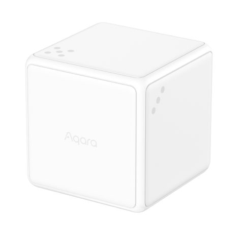

---
layout:
  title:
    visible: true
  description:
    visible: false
  tableOfContents:
    visible: true
  outline:
    visible: true
  pagination:
    visible: false
---

# 스마트 큐브 T1 Pro

<figure><figcaption></figcaption></figure>

### 제품 소개

> 아카라 큐브 T1 Pro는 최신형 무선 컨트롤러로 액션 모드와 장면 모드 두가지 모드를 지원합니다. 액션 모드는 90’ 뒤집기, 180’ 뒤집기, 두번 두드리기, 밀기, 흔들기, 회전하기 등 6가지 모드를 지원합니다. 장면 모드는 1\~6의 각 숫자가 위를 향하는 경우 흔들기, 회전, 들고 있기 등 다양한 제어 방법을 지원합니다.


해당 제품을 사용하기 위해서는 Zigbee을 지원하는 아카라 스마트 허브가 반드시 필요합니다.




<figure><figcaption></figcaption></figure>

### 제품 사양

| 제품명     | 스마트 큐브 T1 Pro      |
| ------- | ------------------ |
| 모델명     | CTP-R01            |
| 제품 크기   | 45 x 45 x 45mm     |
| 제품 무게   | 76g                |
| 배터리 타입  | CR2450             |
| 무선 프로토콜 | Zigbee 3.0         |
| 작동 온도   | -10°C \~ 50°C      |
| 작동 습도   | 95% RH 이하 / 비결로 조건 |



### 주의 사항

* 본 제품은 장난감이 아닙니다. 이 제품을 아이의 손이 닿지 않는 곳에 두세요.
* 본 제품은 실내 사용 용도로 설계되었습니다. 습한 환경이나 실외에서 사용하지 마세요.
* 물기를 조심합니다. 물이나 다른 액체를 제품에 엎지르지 마세요.
* 본 제품을 열원 부근에 놓지 마세요. 제대로 환기되지 않는 곳에 놓지 마세요.
* 본 제품을 자체적으로 수리하려고 하지 마세요. support@aqara.kr에 연락하시기 바랍니다.
* 본 제품은 가정 생활의 오락, 편의성 및 메시지 알림을 개선하는 경우에만 적합합니다. 사용자가 제품 사용 지침을 위반하는 경우, 제조업체는 어떠한 위험 및 재산 손실에도 책임을 지지 않습니다.


### 경고

* 배터리를 잘못된 유형으로 교체하는 경우 폭발의 위험이 있습니다.
* 사용한 배터리는 지침에 따라 폐기하십시오.
* 배터리를 삼키지 마십시오. 화학적 화상의 위험이 있습니다.
* 본 제품에는 코인/버튼 셀 배터리가 포함되어 있습니다. 코인/버튼 셀 배터리를 삼킬 경우 단 2시간 만에 심한 화상을 입을 수 있으며 사망에 이를 수 있습니다.
* 새 배터리와 사용한 배터는 어린아이의 손이 닿지 않는 곳에 보관하시시오.
* 배터리를 삼켰거나 배터리가 신체의 어느 부위라도삽입된 것이라고 생각되면 즉시 의사의 진료를 받으십시오.
* 배터리를 불이나 뜨거운 오븐에 폐기하거나 기계적으로 압쇄하거나 절단하면 폭발을 일으킬 수 있습니다.
* 배터리를 온도가 매우 높은 환경에 두면 폭발이나 인화성 액체 또는 가스의 누출을 유발할 수 있습니다.
* 극저기압에 노출된 배터리는 폭발이나 인화성 액체 또는 가스의 누출을 유발할 수 있습니다.
* 본 기기는 2m 이하의 높이에서만 장착 가능합니다.




### 제품 설치

#### 유효 범위 테스트

큐브를 크게 한번 휘두르거나 리셋 버튼을 누르세요. 허브에서 안내 메시지가 나오는 경우 장치와 허브가 정상적으로 연결되었음을 의미합니다.

* 안정적인 통신을 위해 금속 표면에서 사용하지 마세요.

#### 배터리 교체

동봉된 철제 도구로 큐브 T1 Pro의 배터리 커버를 열고 새로운 CR2450 배터리로 교체해 주세요. (+가 위를 향하도록 교체되었는지 잘 확인해 주세요.)

<figure><figcaption></figcaption></figure>

### Aqara Home 앱 연동

앱 스토어에서 “Aqara Home”을 검색해 다운로드해주세요.

#### 장치 추가

* Zigbee을 지원하는 아카라 허브가 반드시 필요합니다. 허브 설치 가이드에 따라 아나카 허브를 설치해 주세요.
* 동봉되어 있는 철제 도구를 사용하여 배터리 커버를 열어 주세요.
* 아카라 홈 앱의 우측 상단의 “+”를 눌러 “장치 추가” - “큐브 T1 Pro”를 선택한 다음 연결할 허브를 선택해 주세요. 앱의 안내에 장치를 추가하고, 허브에 정상적으로 연결되었음을 확인 할 때까지 리셋 버튼을 5초가 길게 눌러 주세요.

(5) 장치 추가 실패

* 장치 추가에 실패에 경우 최대한 아카라 허브 근처로 이동한 후 다시 시도해 주세요.
* 리셋 버튼을 빠르게 한번 누르거나 큐브를 크게 한번 휘둘러 주세요. 허브에서 소리가 나는 경우 장치와 허브가 정상적으로 연결되었음을 의미합니다.
* 연결하는 스마트 허브마다 다른 방식으로 연결에 성공했다는 메시지를 표시합니다. 자세한 내용은 각 스마트 허브의 설명을 참고해 주세요.

#### 모드 전환하기

아카라 홈 앱을 열어 큐브 T1 Pro를 선택한 후 상단의 “…” 를 눌러 주세요. “추가 설정”을 선택하여 “모드 전환”에서 원하는 모드를 선택해 주세요.



### 기본 기능

**액션 모드**

<figure><figcaption></figcaption></figure>

<figure><figcaption></figcaption></figure>

<figure><figcaption></figcaption></figure>

**장면 모드**

<figure><figcaption></figcaption></figure>

<figure><figcaption></figcaption></figure>

\*애플 홈킷에서는 해당 기능만 지원합니다.


