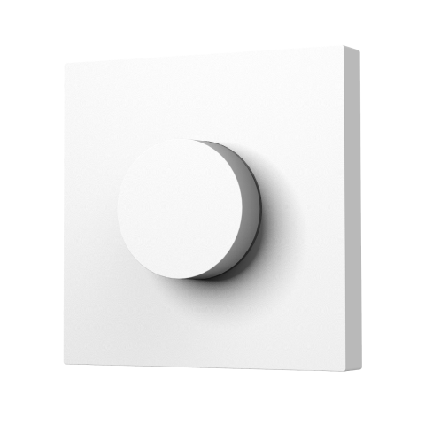

---
layout:
  title:
    visible: true
  description:
    visible: false
  tableOfContents:
    visible: true
  outline:
    visible: true
  pagination:
    visible: false
---

# 무선 노브 스위치 H1

<figure><figcaption></figcaption></figure>

### 제품 소개

> 아카라 무선 노브 스위치 H1는 지그비 무선 통신 프로토콜을 기반으로 한 스마트 홈 제품입니다. 조명, 스마트 커튼 등과 매칭하여 휘도, 색 온도 및 스위치를 제어하거나 다른 스마트 기기와 협력하여 더 많은 연동 제어 효과를 달성하는 데 적합합니다.
>
> 본 제품은 위 그림처럼 다양한 조작을 지원하며, 짧은 누름, 긴 누름, 회전, 누름 및 회전 등이 포함됩니다. 회전 조절기 버튼을 10초 동안 누르고 있으면: 네트워킹 상태로 진입합니다; 어떤 버튼이든 빠르게 5번 누르면: 유효한 통신 거리 검증을 수행합니다.


본 제품은 아카라 허브가 필요합니다.




<figure><figcaption></figcaption></figure>

### 제품 사양

| 제품명     | 무선 노브 스위치 H1         |
| ------- | -------------------- |
| 모델명     | ZNXNKG02LM           |
| 제품 크기   | 86 x 86 x 24 mm      |
| 배터리     | CR2032               |
| 무선 프로토콜 | Zigbee 3.0           |
| 작동 온도   | -10°C \~ 50°C        |
| 작동 습도   | 0 \~ 95% RH / 비결로 조건 |



### 주의 사항

* 본 제품은 장난감이 아닙니다. 이 제품을 아이의 손이 닿지 않는 곳에 두세요.
* 본 제품은 실내 사용 용도로 설계되었습니다. 습한 환경이나 실외에서 사용하지 마세요.
* 물기를 조심합니다. 물이나 다른 액체를 제품에 엎지르지 마세요.
* 본 제품을 열원 부근에 놓지 마세요. 제대로 환기되지 않는 곳에 놓지 마세요.
* 본 제품을 자체적으로 수리하려고 하지 마세요. support@aqara.kr에 연락하시기 바랍니다.
* 본 제품은 가정 생활의 오락, 편의성 및 메시지 알림을 개선하는 경우에만 적합합니다. 사용자가 제품 사용 지침을 위반하는 경우, 제조업체는 어떠한 위험 및 재산 손실에도 책임을 지지 않습니다.


### 경고

* 배터리를 잘못된 유형으로 교체하는 경우 폭발의 위험이 있습니다.
* 사용한 배터리는 지침에 따라 폐기하십시오.
* 배터리를 삼키지 마십시오. 화학적 화상의 위험이 있습니다.
* 본 제품에는 코인/버튼 셀 배터리가 포함되어 있습니다. 코인/버튼 셀 배터리를 삼킬 경우 단 2시간 만에 심한 화상을 입을 수 있으며 사망에 이를 수 있습니다.
* 새 배터리와 사용한 배터는 어린아이의 손이 닿지 않는 곳에 보관하시시오.
* 배터리를 삼켰거나 배터리가 신체의 어느 부위라도삽입된 것이라고 생각되면 즉시 의사의 진료를 받으십시오.
* 배터리를 불이나 뜨거운 오븐에 폐기하거나 기계적으로 압쇄하거나 절단하면 폭발을 일으킬 수 있습니다.
* 배터리를 온도가 매우 높은 환경에 두면 폭발이나 인화성 액체 또는 가스의 누출을 유발할 수 있습니다.
* 극저기압에 노출된 배터리는 폭발이나 인화성 액체 또는 가스의 누출을 유발할 수 있습니다.
* 본 기기는 2m 이하의 높이에서만 장착 가능합니다.




### 제품 설치

**유효 범위 테스트**

미리 선택한 위치에서 버튼을 5번 누르면 허브가 안내음을 발생시켜, 장치가 허브와 효과적으로 통신할 수 있음을 나타냅니다.

* 안정적인 무선 통신을 보장하기 위해 금속 표면에 설치를 피해주십시오.

(방법 1) 필요한 위치에 설치 하세요.

<figure><figcaption></figcaption></figure>

(방법 2) 접착 보호 필름을 떼어내고 필요한 위치에 부착하십시오.

<figure><figcaption></figcaption></figure>

* 지정된 위치의 표면이 깨끗하고 건조한지 확인해 주세요.

(방법 3) 슬롯형 스크루드라이버를 사용하여 스마트 회전 조절기 H1 (무선)의 후면 커버를 제거하고, 날카로운 도구나 전동 드릴로 후면 커버의 86 숨겨진 박스의 나사 부분의 얇은 고무를 관통하십시오. 86 숨겨진 박스에 제공된 나사를 고정하고 스마트 회전 조절기 H1 (무선)의 패널을 설치하십시오.

(1) 나사 드라이버를 사용하여 후면 커버를 열어주세요.

<figure><figcaption></figcaption></figure>

(2) 마트 회전 조절기 H1 (무선)의 후면 커버의 나사 위치에 오울이나 다른 날카로운 도구로 구멍을 뚫으세요.

<figure><figcaption></figcaption></figure>

(3) 나사로 후면 커버를 86 숨겨진 박스에 고정하고 패널을 덮어주세요.

<figure><figcaption></figcaption></figure>

(방법 4) 무선 노브 스위치 H1의 후면 커버에 있는 미끄럼 방지 실리콘 스트립을 제거하고, 후면 커버를 아카라 결합 프레임과 함께 제공된 나사로 결합 프레임에 고정한 다음 무선 노브 스위치 H1의 패널을 설치하세요.

(1) 무선 노브 스위치 H1의 후면 커버에 있는 미끄럼 방지 실리콘 스트립을 떼어내세요.

<figure><figcaption></figcaption></figure>

(2) 스크루드라이버를 사용하여 무선 노브 스위치 H1의 후면 커버를 열어주세요.

<figure><figcaption></figcaption></figure>

(3) 후면 커버를 나사로 결합 프레임에 고정하고 패널을 덮어주세요.

<figure><figcaption></figcaption></figure>

### Aqara Home 앱 연동

앱 스토어에서 “Aqara Home”을 검색해 다운로드해주세요.

#### 장치 추가

(1) 빠른 설치 가이드에 따라 앱에 허브를 추가하세요.

(2) 아카라홈 앱을 실행하세요. 앱의 메인화면에서 우측 상단의 “+” 버튼를 누르고 “장치 추가”를 선택하면 장치 추가 페이지로 이동합니다. “무선 리모트” 탭에서 “무선 노브 스위치 H1”를 선택하고 화면에 보이는 대로 따라 하십시오.

* 만일 연결에 실패하였다면, 허브를 스위치에 가깝게 옮긴 후 전원을 투입하고 다시 시도해 보세요.

**Zigbee 무선 통신 유효 범위 테스트**

조명 스위치의 버튼을 1번 클릭하세요. 허브에 음성프롬프트가 나올 경우, 디바이스와 허브가 정상적으로 통신할 수 있다는 것을 나타냅니다.


