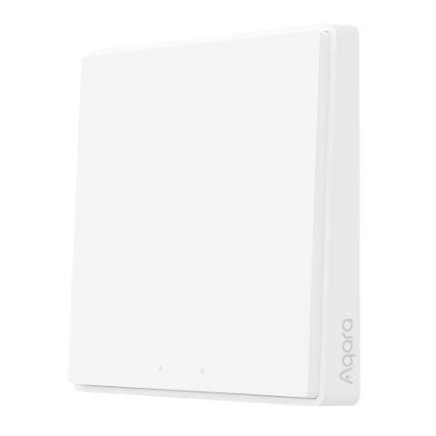

---
layout:
  title:
    visible: true
  description:
    visible: false
  tableOfContents:
    visible: true
  outline:
    visible: true
  pagination:
    visible: false
---

# 무선 리모트 스위치 T1 1구

<figure><figcaption></figcaption></figure>

### 제품 소개

> 아카라 스마트 무선 스위치는 저전력 원격 제어 스위치입니다. 어느 곳에든 놓거나 붙일 수 있습니다. 한번 누름,두 번 연속 누름 또는 길게 누름으로 스마트 라이트 및 스마트 플러그 같은 여러 스마트 액세서리를 제어합니다. 본 제품은 50,000번의 눌림 시험을 통과하였으며 고온 환경에서도 잘 견딜 수 있는 난연 V-0등급 재질과 자외선 차단 소재로 제작되어 장기간 사용이 가능합니다.


* 허브 필요
  * 아카라 허브는 이 제품을 애플 홈킷 기술로 작동할 수 있게 하는데 필요합니다.
* 이 제품은 실내용입니다.




<figure><figcaption></figcaption></figure>

### 제품 사양

| 제품명      | 무선 리모트 스위치 T1 1구     |
| -------- | -------------------- |
| 모델명      | WXKG05LM             |
| 제품크기     | 86 x 86 x15.12 mm    |
| 무선 통신 방식 | Zigbee 3.0           |
| 작동 온도    | -10°C \~ 50°C        |
| 작동 습도    | 0 \~ 95% RH / 비결로 조건 |



### 주의 사항

* 본 제품은 장난감이 아닙니다. 이 제품을 아이의 손이 닿지 않는 곳에 두세요.
* 본 제품은 실내 사용 용도로 설계되었습니다. 습한 환경이나 실외에서 사용하지 마세요.
* 물기를 조심합니다. 물이나 다른 액체를 제품에 엎지르지 마세요.
* 본 제품을 열원 부근에 놓지 마세요. 제대로 환기되지 않는 곳에 놓지 마세요.
* 본 제품을 자체적으로 수리하려고 하지 마세요. support@aqara.kr에 연락하시기 바랍니다.
* 본 제품은 가정 생활의 오락, 편의성 및 메시지 알림을 개선하는 경우에만 적합합니다. 사용자가 제품 사용 지침을 위반하는 경우, 제조업체는 어떠한 위험 및 재산 손실에도 책임을 지지 않습니다.


### 경고

* 배터리를 잘못된 유형으로 교체하는 경우 폭발의 위험이 있습니다.
* 사용한 배터리는 지침에 따라 폐기하십시오.
* 배터리를 삼키지 마십시오. 화학적 화상의 위험이 있습니다.
* 본 제품에는 코인/버튼 셀 배터리가 포함되어 있습니다. 코인/버튼 셀 배터리를 삼킬 경우 단 2시간 만에 심한 화상을 입을 수 있으며 사망에 이를 수 있습니다.
* 새 배터리와 사용한 배터는 어린아이의 손이 닿지 않는 곳에 보관하시시오.
* 배터리를 삼켰거나 배터리가 신체의 어느 부위라도삽입된 것이라고 생각되면 즉시 의사의 진료를 받으십시오.
* 배터리를 불이나 뜨거운 오븐에 폐기하거나 기계적으로 압쇄하거나 절단하면 폭발을 일으킬 수 있습니다.
* 배터리를 온도가 매우 높은 환경에 두면 폭발이나 인화성 액체 또는 가스의 누출을 유발할 수 있습니다.
* 극저기압에 노출된 배터리는 폭발이나 인화성 액체 또는 가스의 누출을 유발할 수 있습니다.
* 본 기기는 2m 이하의 높이에서만 장착 가능합니다.






### 제품 설치

유효 범위 테스트: 원하는 위치에서 리모트 스위치의 버튼을 5번 빠르게 누릅니다. 허브에 음성 프롬프트가 나타나는 경우, 리모트 스위치가 허브와 유효하게 통신할 수 있다는 것을 나타냅니다.

* 신호 강도를 극대화하려면 금속 표면에 놓지 마십시오.
* 원하는 위치에 직접 놓습니다.

### Aqara Home 앱 연동

앱 스토어에서 “Aqara Home”을 검색해 다운로드해주세요.

#### 장치 추가

* 아카라 허브의 사용 설명서에 따라 허브를 앱에 추가해 주십시오.
* 사용 전에 배터리 절연 탭을 제거해 주십시오.
* 아카라홈앱을 열고 메인 화면에서 우측 상단의 “+”를 누르고, “장치 추가”를 누릅니다. “무선 리포트” 탭을 누르시고 “무선 리모트 스위치 T1 (1구)” 선택하신 후, 지시에 따라 장치를 추가 합니다.
* 연결이 되지 않는 경우, 리모트 스위치 T1를 허브에 더 가까이 이동시켜서 다시 시도해 주십시오.







